<!-- markdownlint-disable MD022 MD032 -->
<!-- # Mobile Web Specialist Nanodegree -->
# Browser Rendering Optimization

[<-- back to Mobile Web Specialist Nanodegree homepage](../index.html)

---

## 9. The Critical Rendering Path
### 9.1 Course Introduction
Hi I'm Paul Lewis and I'm a Developer Advocate at Google. And I'm Cameron Pittman. I make front end web development courses here at Udacity.

We're here to help you develop apps that run at a silky smooth 60 frames per second. And you may think it's just JavaScript that you need to worry about but there's actually a lot more to it than that. This course is about changing the way that you approach performance issues. We're going to help you look at the bigger picture.

Okay let's play a game.This was made by my colleague Jake Archibald and it's designed to show off problems with frame rates and performance on the web.

See these ships at the top? They move smoothly. The ones at the bottom judder. The game is super simple; shoot the juddering ships as quickly as you can by clicking on them. You're going to have to spot them amongst the smooth ones.

### 9.2 Jank Invaders
[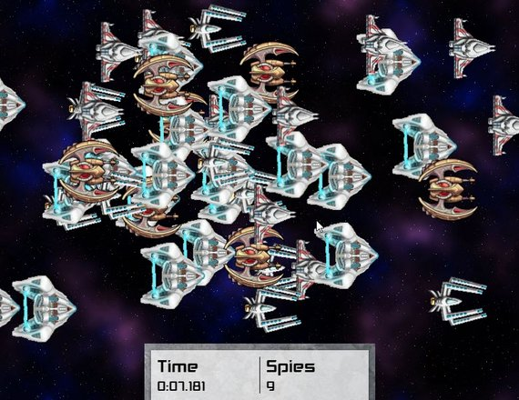](../assets/images/bro1-3.jpg)

Link to [Jank Invaders Game](http://jakearchibald.github.io/jank-invaders/)

### 9.3 Lesson IntroThroughout this course you'll be working on a bunch of samples with performance issues. But by the end of the course, you'll be applying what you've learned to make silky, smooth experiences.

But first, in order to develop an app that runs at 60 frames per second, you need to understand what goes into creating each frame.

In this lesson, you'll be getting the background knowledge that you need about the browser's rendering pipeline.If you've taken web performance optimization with Ilya Gregorich and me, this will seem pretty familiar.

The point of this lesson is to help you experience what potential bottlenecks may slow down rendering.

In the next lessons, you'll be diagnosing and solving common performance issues, as well as getting a sense for how to approach performance at different stages in your app's life cycle.

### 9.4 Juddering
Avoiding jutter is extremely important to users. You just saw what a difference it made in Jank Invaders just now. But, it's not just games. It can affect all sites and web apps.

Let's put that in the context of native apps a second. Think about what you do when you're choosing between two native apps that do the same kinds of things. How do you decide between two?

Well, I'll look at reviews and see what people say about the app's features and, you know, I'm also interested in performance. A quick look around poorly rated apps tells you that users notice and they care when an app judders or stops for,like, one to two seconds whenever I click on this thing.

When that happens they, and you, would choose an app that performs better and it's no different with the web.

Bad performance kills good sites. Equally, users love experiences that are smooth, that stick to their finger and react quickly. Another colleague of mine Paul Kinlan ran a survey about the features that people want from a news app. And the most requested feature was smooth navigation. Smooth, as in, no jank. In fact, 77% of people wanted it.

This course will explain how you can think about your project's performance and what tools you have at your disposal, and what you're looking for and how to fix common issues. You're going to hunt down causes of sticky scrolling, flickering updates, and juttering animations.

But first, you'll start your 60 frames per second journey by exploring what goes into a single frame.

### 9.5 Frames
If there's any kind of visual change on screen, from scrolling to animations, the device is going to put up a new picture, or frame, onto the screen for the user to see.

Most devices today refresh their screen 60 times a second, which we measure in hertz. And so to match that we need to have 60 frames to put up.

Most of the time we'll refer to this as 60 frames a second or fps.

People are especially good at noticing when we miss one of these frames. And they don't like it. Think of how easy it was to spot in Jank Invaders. If the browser is taking too long to make a frame, it will get missed out. The frame rate will drop and users will see stuttering. If it's really bad, then the whole screen can lock up, which is the worst.

### 9.6 Quiz: ms Per Frame

#### 9.6 Solution
I'll take 1000 milliseconds and divide it by 60 frames per 1000 milliseconds and I'll get about 16 milliseconds per frame.

This means that in order to achieve a silky smooth 60 frames per second, you need to keep all of the work in making the frame under 16 milliseconds.

But actually, the browser also has some housekeeping work to do in every frame. So realistically, you have **somewhere in the region of 10 to 12 milliseconds** to get everything done and make sure the frame arrives on time.

### 9.7 What's in One Frame
You can't optimize your app's frame rate if you don't understand how the browser actually renders a frame. So you need to learn how a page is actually put together when it's first loaded.

Okay, so let's take a look at what goes into making a frame.

Initially the browser makes a GET request to a server. The server responds by sending some HTML.

At this point, the browser does some pretty clever stuff with lookahead parsing. But what we care about is that it parses the document and gives us these notes.

[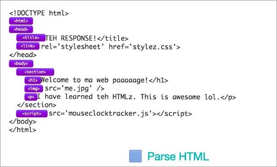](../assets/images/bro1-8.jpg)

In Chrome DevTools, you'll see it as Parse HTML.

Okay, so this is what the DOM looks like as a tree. But let's just make it a bit easier for ourselves, and call it the DOM.

As well as the DOM, we also have CSS. And this comes from the user agent, it comes from your style sheets or any inline styles you have, and perhaps third party styles.

The next part of the process is to combine the DOM and CSS.

In the tools you're going to see this as Recalculate Styles.

When combined, we get a new tree called the Render Tree.

The Render Tree looks pretty similar to the DOM, except that some things are missing.

For example, we don't have the head anymore, we don't have any scripts. In fact, if we had some CSS that set the section paragraph to `display: none`, then it would be removed from the render tree.

Equally if we had some CSS that added a pseudo element like after or before, this would get added to the render tree even though it doesn't live in the DOM.

It's important to note that only elements that will actually be displayed on the page will make it into the render tree.

So this is essentially a simplified view of where the critical rendering path optimization gets you.

### 9.8 Quiz: Render Tree

#### 9.8 Solution

And the correct answer is any element with a class of style none.

If an element is set to display none that means that the element is not going to be rendered whatsoever. For the other three options, though they may not take up any space on the page that you're seeing they're still a part of the page. Which means that the browser will still put style three, style four, and style two before on the render tree.

In order for `.style2` to end up in the render tree, it needs to have some content, like '' assigned to it.

### 9.9 DOM, CSSOM, Render Tree
Okay, back to the rendering process of a single frame.

Once the browser knows which rules apply to an element, it can begin calculate layout. Or it, in other words, how much space elements take up and where they are on the screen.

So, here's all the CSS that we want to apply. And layout turns this tree

into a collection of boxes like this.

[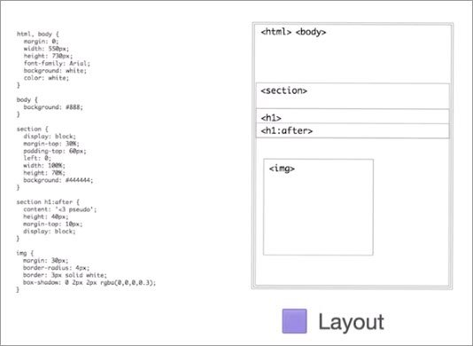](../assets/images/bro1-18.jpg)

In the tooling, you'll see this as layout.

The web's layout model means that one element can affect others. So, for example, the width of body typically affects the children's widths and so on, all the way down the tree. So the process can be quite involved for the browser. Sometimes, you may hear layout called reflow. It's the same thing.

The next step in the process is to talk about vector to raster. For example, the boxes we had before were vectors like this, just shapes.

But now what we need to do is fill in individual pixels, like this. And that's what a rasterizer is for.

So, this is the layout we had before, and these are the draw calls that the rasterizer will make to fill it in.

When done, it will look like this.

[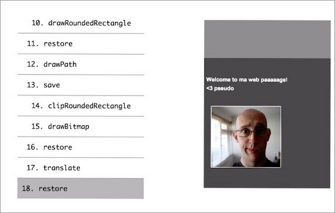](../assets/images/bro1-22.jpg)

But that's a little too quick, so let's step through and see it build up the picture bit by bit.

So you can see, these rectangles start to appear, then some text.

[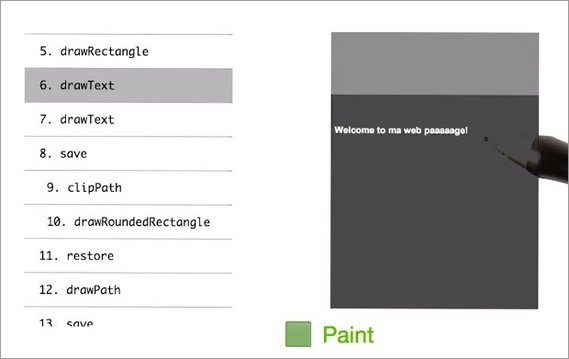](../assets/images/bro1-23.jpg)

And we get a shadow, a white line, a picture, and finally it tightens up.

[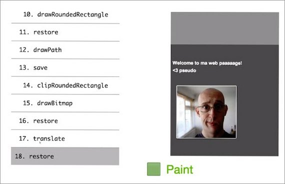](../assets/images/bro1-24.jpg)

The tooling is going to show you this as paint.

You may have noticed in that previous list that one of the calls was called `drawBitmap`. What we normally do is we send things like JPEGs, orPNGs or GIFs down the wire to our page. But what the browser has to do is decode these into memory, like this.

In the tooling, you'll see it as Image Decode. Potentially, we're doing something like responsive web design. And so the image may also need resizing.

Painting, as you may have noticed just now, was done into a single surface. However, sometimes browsers make multiple surfaces called layers or compositor layers and it can paint into those individually.

So here I have a site and this masthead has its own layer. That means we can paint the content behind. And we can paint the masthead itself.

The process of handling these layers is shown in the tooling as composite layers.

This masthead is a layer, but because we have buttons for next and previous on top of it they are also turned into layers as well.

In this course, we're going to talk about layer management to make sure that you don't create extra layers by accident.

Now, we can put all these layers back together. And so now we've finished painting all the layers for our page. To be honest, painting actually happens into a grid of tiles like this.

I mentioned it for completeness, but it's not something we get to control as developers. All of this happened on the CPU. The layers themselves and their tiles will be uploaded to the GPU.

Again, this will be included in composite layers. And lastly, the GPU will be instructed to put the pictures up on the screen.

And that, in brief, is how we get from a single request all the way through to pixels on screen.

### 9.10 Quiz Layout
For this quiz, I'm giving you a sample DOM, there's a body with a div container underneath it. And then a child div underneath the container.

[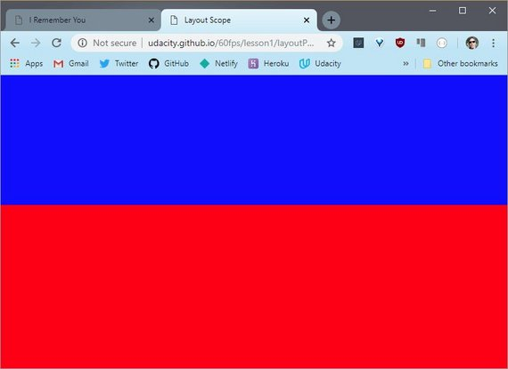](../assets/images/bro1-33.jpg)

If you make changes to the geometry of any of these elements, the browser will have to run layout. So, my question for you is, which of these elements, will when changed, include more of their parent elements in the scope of the resulting layout.

In other words, will changing the geometry of any of these elements trigger layout against most or all of the page? If so, which one triggers more? You can use [the sample site to find out](http://udacity.github.io/60fps/lesson1/layoutPaint/index.html).

Clicking once makes a change to the body, clicking again makes a change the top level div, and the last click changes the child div.

If you're already familiar with DevTools, you can record a timeline trace to see what layout happened after each click on this page. If not that's no big deal,you'll be learning how to use the timeline next lesson, and i'll be demonstrating how to find information about layout in the solution video.

You can also check out the link in the instructor notes fora little bit more information. So, do some analysis if you can, but otherwise make a prediction. Will changing the width of the body trigger layout with a larger scope than changing the width of this div, or will they have the same scope? Pick one of these answers.

#### Links

- [Sample Site](http://udacity.github.io/60fps/lesson1/layoutPaint/index.html)
- [How to Use the Timeline Tool](https://developer.chrome.com/devtools/docs/timeline#rendering-event-properties)  - The Timeline tool is now deprecated'. See Performance Tool below.
- [Get Started With Analyzing Runtime Performance](https://developers.google.com/web/tools/chrome-devtools/evaluate-performance/) - Replaces Timeline Tool

#### 9.10 Solution
Which change creates more work for the browser during layout?

- [ ] Changing the width of the body
- [ ] Changing the width of the div
- [x] They create the same work

Right! No matter what, layout needs to be run against the whole page.

Believe it or not the correct answer is that they have the same scope. In both cases the browser has to assume the worst. Meaning that the change invalidated the entire DOM.

The browser then has to keep the entire DOM in scope while it's running layout. This is the Performance panel in dev tools which you'll be spending quite a bit of time with later in this course.

[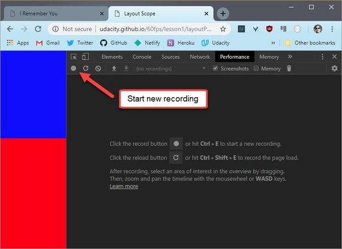](../assets/images/bro1-34.jpg)

To see what happens when I click around on the page, I will go ahead and click this button which starts recording and then I will click once, twice, three times and then stop recording.

Like I said, you'll be spending quite a bit of time with this tool later in the course, so I’m going to quickly zoom in and show you what you need to see.

This is the first click event which affected the geometry of the body.

You can see that the click lead to other pieces of work.

Next I click on the Layout segment which gives me further detail.

I can see that "Nodes That Need Layout" is **3 of 5**. Which means that three of the five DOM nodes are affected by this.

[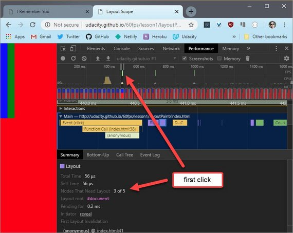](../assets/images/bro1-37.jpg)

Okay now I wonder what it looks like for the other two elements.

Here's the second click event, which affected the top level div. And this is the resulting layout.

[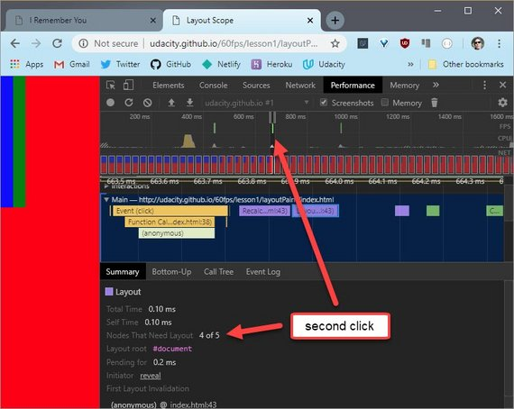](../assets/images/bro1-38.jpg)

Notice that, in this case, that four of the five nodes were affected by this.

Now I'll look at the last one. Here's the last click event on the child div. So this div is the farthest down on the DOM. And here's the resulting layout.

Here it looks like all five nodes are affected by this.

You may have noticed as I was going through the clicks that the different layout events affected different numbers of nodes. But the whole time the entire DOM was in scope.

In case you're wondering, it's possible but very difficult to limit layout scope. You can use something called a layout boundary but Paul and I won't be getting into that in this class.

So if there is one take away from this question, it's that the layout process is complicated and it's probably best to assume that the entire DOM is always in scope.

### 9.11 Layout and Paint
So this is what a typical frame looks like for as developers when things are more than just a static page.

It looks like the pipeline I talked about just before except I've now chucked JavaScript at the front.

Normally, you're going to use JavaScript to handle work that will result in visual changes. Whether it's jQuery's animate function, sorting a data set, or adding DOM elements to the page. But you don't have to use JavaScript for your visual changes. In fact, for many applications developers use CSS animations, transitions, or even the new Web Animations API to make visual changes to their page.

Now with that out of the way, we can talk about the pipeline a bit more.

The changes we make here won't necessarily trigger every part of the pipeline either. In fact, there are three ways the pipeline normally plays out fora given frame. So let's talk about those for a second.

#### One
So number one, you make a visual change either with CSS Or JavaScript.

The browser must recalculate the styles of the elements that were affected. Now if you changed a layout property, so that's one that changed an element's geometry like its `width`, `height`, or position with relation to another element like `left` or `top`, then the browser will have to check all the other elements and re-flow the page. Any affected areas will need to be repainted. And the final painted elements will need to be composited back together.

#### Two
The second way the pipeline gets used is when you change a paint only property, like `background-image`, text `color`, or shadows.

This time, we make the change, the styles are calculated, we don't do layout because we didn't change the geometry of any elements. We do paint and we do composite.

#### Three
And the last way involves changing something that requires neither layout, nor paint, just compositing.

[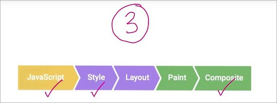](../assets/images/bro1-44.jpg)

Compositing is where the browser puts the individual layers of the page together. And that requires layer management to ensure we have the right layers, and in the correct order. So we make our change. We do style calculations, but we only do composite.

You probably noticed that style was always included for each of those variations. Different styles affect which parts of the pipeline we touch; And therefore the performance characteristics of our apps.

### 9.12 Quiz: Render
Here's a scenario for you to consider. Flexbox is a very useful tool for responsive design. It's a CSS display property that resizes elements, and reflows them on the page. For instance, imagine you've got these three elements on a page and then the user resizes the screen to become larger. As a result, the elements themselves become larger.

[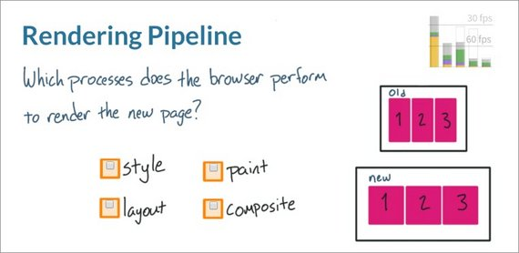](../assets/images/bro1-45.jpg)

In this scenario, which of the following processes does the browser perform to render the new page? Does the browser perform style, layout, paint, or composite? Check all that apply.

#### 9.12 Solution
I'll start with style. There are no style calculations here, because the element styles are already known. So, on the screen resize event, the styles are actually applied through layout. And as you just learned, if the browser runs layout, it also has to paint the elements in their new positions on the page, and then composite them together.

[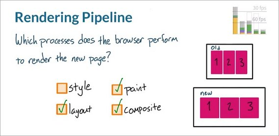](../assets/images/bro1-46.jpg)

There are actually exceptions to the lack of style here, however. If there was a resize handler that changed the style, or if a media query break point was hit, then the browser would actually have to recalculate styles. But that's not happening here, so don't check that box.

### 9.13 Quiz: CSS Research
For this quiz, I want you to head over to [csstriggers.com](https://csstriggers.com/) and do some research.

I want you to find a CSS property that triggers layout, paint, and composite, and type it into the first box. Then find a CSS property that only triggers paint and composite and type it into the second box. Lastly, find a CSS property that only triggers composite and type it into the third box.

The reason you're checking out csstriggers.com is because it's a super useful resource for determining the amount of work your CSS will trigger.

It's really important to become familiar with it if you want to write performant websites.

#### 9.13 Solution
This quiz, I picked `margin-left` for layout, paint, and composite, `color` for paint and composite, and then `transform` for just composite.

[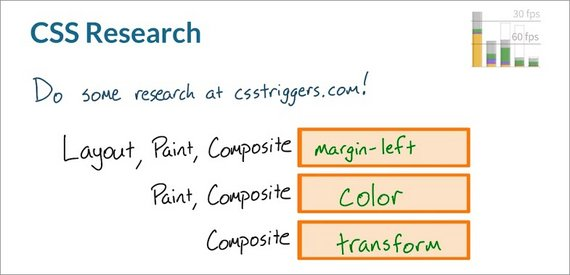](../assets/images/bro1-48.jpg)

Not all CSS is created equal. Some CSS properties have much wider-reaching consequences than others.

Your CSS should trigger the least amount of work possible, and that's going to mean avoiding paint and layout whenever possible.\

Transforms and opacity are far and away the best properties to change, because they can be handled just by the compositor if the element has its own layer. You'll learn more about how to create and manage layers later in the course.

### 9.14 Final Project
Right now you are looking at the app that you'll be debugging at the end of this course.

It uses the Hacker News API to show the most recent stories and their scores.

Right now its performance is pretty awful, especially on mobile, but there's really no reason it shouldn't be hitting 60 frames per second.

By the end of this course, you'll have the skills, techniques, and above all, you'll have the mindset needed to turn this janky experience into an amazing 60 frames per second experience.

### 9.15 Lesson Outro
Okay, you're well on your way to getting some good performance. You know

- why we care about hitting 60 frames a second
- what goes into making a frame
- that the properties we change affect the performance in different ways

In the next lesson, you'll begin your first real performance battle. Jank is more problematic at some points in an app's life cycle than at others .And you'll need to spend your time and effort on the areas that matter most to your users.