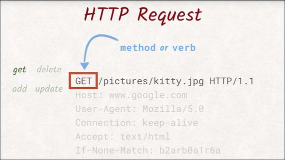
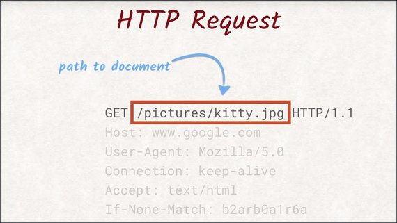
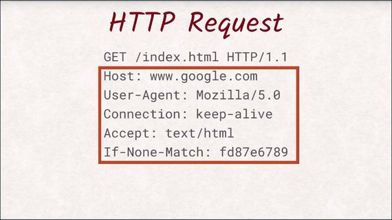
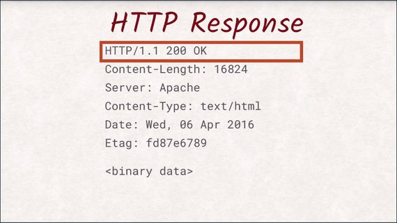

<!-- markdownlint-disable MD022 MD032 -->
<!-- # Mobile Web Specialist Nanodegree -->
# Client-Server Communication

[<-- back to Mobile Web Specialist Nanodegree homepage](../index.html)

---

### Supporting Links

## 1. HTTP's Req/Res Cycle
### 1.1 Course Intro

Welcome to Client Server Communications, a course about the web.

Technically, the web is only a small part of the internet. However, it is the only part of the internet that people use without even realizing that what they're using is the web.

The web is the platform that you, the web developer, can use to publish your ideas to the world. It is the common language between your servers and your clients.

Every time you open a browser, every time you download an app, every time you receive a message on WhatsApp or Facebook, you're using the web.

More generically, in that very moment, a client is communicating with a server, and vice versa.

But what does that actually mean? What's happening when you navigate to a web site? How did the phone know that somebody sent me a message? What capabilities does the web have, and more importantly, what are its limitations?

Hi ,I'm Surma. I'm an engineer at Google in London, and I work with the Chrome team.

In this course, we are going to understand what the web actually is, how we can use it to your advantage,and how you can avoid mistakes that will make both your user experience and security suffer.

Some of this may seem like review, and it is, but we will also go into the lesser known parts of HTTP.

To think like an engineer, you need to understand both the semantics that HTTP uses, as well as the implementation inside the browser.

We'll use that knowledge to

- use browser APIs to the fullest potential
- secure HTTP against eavesdroppers
- deploy the web's newest protocol, HTTP2.

All this knowledge will help you make informed decisions for your app and persuade others when optimizing and securing their apps.

Hi.I'm Richard, a course developer at Udacity and an experienced web developer.

While Surma teaches you about HTTP's request and response cycle, security, and the best practices of HTTP2, I'll be here to reinforce this knowledge with examples and quizzes.

Understanding both the capabilities and limitations of the medium we work in on a day to day basis will help you take the next important step towards mastery.

By the end of this course, you will understand literally every byte that is being sent from your browser to the server and back.

### 1.2 HTTP Requests
The internet has been around for longer than the web. While computers already had something to communicate with over the internet, like email or FTP, there was no common and publicly available way to publish and access documents.

This is where Tim Berners-Lee comes in. He wanted an open mechanism for researchers to publish, read, and comment on papers through the internet.

He wanted a mesh of linked documents that were called hypertext documents. Berners-Lee chose a subset of SGML and called it HTML, the Hypertext Markup Language.

Then he designed HTTP, the Hypertext Transfer Protocol, to transfer these HTML documents.

Hypertext sounds all futuristic and complicated. But it simply means that the text in that document can have references to other documents. These references are called links.

By getting a document, the user can not only read that document but they can navigate to related documents through these links. Especially in a scientific context for which Berners-Lee designed it, this feature turned out to be incredibly useful.

Hypertext can refer to more than text, though. Files can link to images, code, styles, or anything else.

### 1.3 HTTP Requests 2
How does HTTP work?

In its original form, Berners-Lee came up with a template that you can fill into make a request for a document on a server.

The original protocol, later called HTTP 0.9, was incredibly limited. You fill in if you want to retrieve or store a document, where to store the document, including the name and any additional information you think is necessary.

This request is then handed to the server.

Since the server speaks HTTP, it knows that this is an HTTP request and can, therefore, understand what the client wants.

The protocol also has templates for the responses. These are a bit more versatile, since a single request can have a variety of outcomes, including:

- errors
- unreadablerequest forms,
- redirecting the client to a completely different server.

Luckily, Rich did a good job, and I know what he wants.

The only thing left for me to do is fill out this form so Richard knows which request I'm responding to. Bandwidth problems.

### 1.4 Fetching a single req
The tubes and forms are basically the underlying concept of HTTP, **requests**, and **responses**.

Well, we're not really going to be shoving paper through tubes, but rather data through network cables.

This is what an actual request looks like.

This is the exact text the browser sends to the server to request an image called kitty.jpg. Let's dig into the first line a little bit.

In this case, we are trying to 'GET' a document from the server. The protocol is also able to add, delete, and update documents.

To distinguish between these capabilities, the first line starts with an HTTP method or a verb. This request uses the GET method, which means we want the server to send data to us.

Another example of a method is POST, which instructs the server to save the data we are sending.

There are more methods than these, but we'll worry about them later when we talked about REST APIs. Let's get back to the original request.

After the method, comes the path and name of the document we would like to get. Here, we want the server to send us a file called kitty.jpg located in the pictures directory.

The last thing in the first line is the version of the HTTP protocol we are using.

As of today HTTP/1.1 is the most common and widely supported version, however HTTP/2 is slowly catching up and taking over as the de facto standard.

More on this later. Surma is now going to show you the different kinds of headers an HTTP request can have.

### 1.5 Fetching a single ref 2
This part of the request is called the header section, as it contains the headers.

Headers are additional data about the request itself.

A lot of these headers are standardized and contain information like:

- what type of browser is making the request
- what kind of format the browser supports
- what version of the document is already available in the browser's local cache.

All of these headers are optional except for the host header.

The smallest request that can be made would only consist of the first line and a host header.

At a first glance, a response looks very similar to a request. The biggest difference is probably the first line.

Here you can find out the status code of the response that indicates if your request was fulfilled successfully, if the document was not found, or if the server wants to redirect you somewhere else.

Just like with the request, the next section is the header section. 

It not only contains data about the document, but also about the server and the connection.

Again, most of these headers are optional. The only obligatory header is content-length to tell the client how many bytes of data it should expect.

After the headers and an additional empty line,the actual document is sent. This can be a JPEG image an HTML document or whatever you want to transfer to the user.