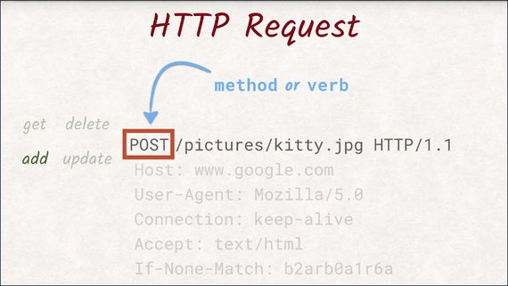
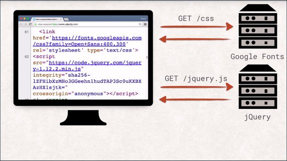
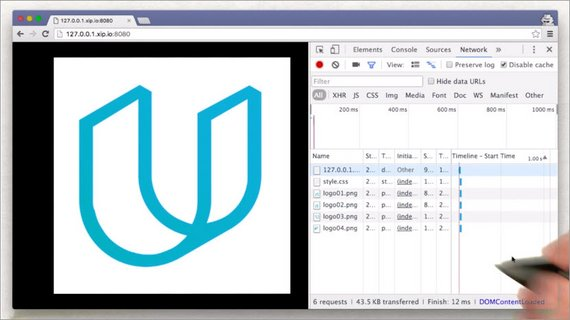
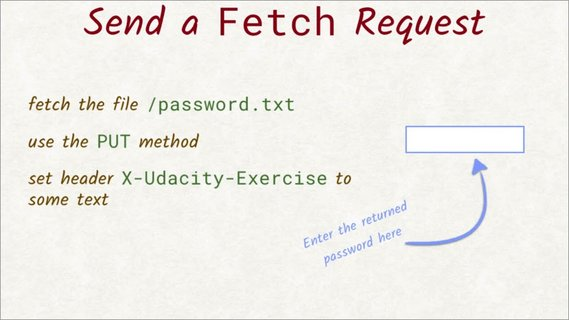

<!-- markdownlint-disable MD022 MD032 -->
<!-- # Mobile Web Specialist Nanodegree -->
# Client-Server Communication

[<-- back to Mobile Web Specialist Nanodegree homepage](../index.html)

---

### Supporting Links

## 1. HTTP's Req/Res Cycle
### 1.1 Course Intro

Welcome to Client Server Communications, a course about the web.

[](../assets/images/cs1-1.jpg)

Technically, the web is only a small part of the internet. However, it is the only part of the internet that people use without even realizing that what they're using is the web.

The web is the platform that you, the web developer, can use to publish your ideas to the world. It is the common language between your servers and your clients.

[](../assets/images/cs1-2.jpg)

Every time you open a browser, every time you download an app, every time you receive a message on WhatsApp or Facebook, you're using the web.

More generically, in that very moment, a client is communicating with a server, and vice versa.

But what does that actually mean? What's happening when you navigate to a web site? How did the phone know that somebody sent me a message? What capabilities does the web have, and more importantly, what are its limitations?

Hi ,I'm Surma. I'm an engineer at Google in London, and I work with the Chrome team.

[](../assets/images/cs1-3.jpg)

In this course, we are going to understand what the web actually is, how we can use it to your advantage,and how you can avoid mistakes that will make both your user experience and security suffer.

Some of this may seem like review, and it is, but we will also go into the lesser known parts of HTTP.

To think like an engineer, you need to understand both the semantics that HTTP uses, as well as the implementation inside the browser.

We'll use that knowledge to

- use browser APIs to the fullest potential
- secure HTTP against eavesdroppers
- deploy the web's newest protocol, HTTP2.

All this knowledge will help you make informed decisions for your app and persuade others when optimizing and securing their apps.

Hi.I'm Richard, a course developer at Udacity and an experienced web developer.

[](../assets/images/cs1-4.jpg)

While Surma teaches you about HTTP's request and response cycle, security, and the best practices of HTTP2, I'll be here to reinforce this knowledge with examples and quizzes.

Understanding both the capabilities and limitations of the medium we work in on a day to day basis will help you take the next important step towards mastery.

By the end of this course, you will understand literally every byte that is being sent from your browser to the server and back.

### 1.2 HTTP Requests
The internet has been around for longer than the web. While computers already had something to communicate with over the internet, like email or FTP, there was no common and publicly available way to publish and access documents.

This is where Tim Berners-Lee comes in. He wanted an open mechanism for researchers to publish, read, and comment on papers through the internet.

He wanted a mesh of linked documents that were called hypertext documents. Berners-Lee chose a subset of SGML and called it HTML, the Hypertext Markup Language.

[](../assets/images/cs1-5.jpg)

Then he designed HTTP, the Hypertext Transfer Protocol, to transfer these HTML documents.

Hypertext sounds all futuristic and complicated. But it simply means that the text in that document can have references to other documents. These references are called links.

By getting a document, the user can not only read that document but they can navigate to related documents through these links. Especially in a scientific context for which Berners-Lee designed it, this feature turned out to be incredibly useful.

Hypertext can refer to more than text, though. Files can link to images, code, styles, or anything else.

### 1.3 HTTP Requests 2
How does HTTP work?

In its original form, Berners-Lee came up with a template that you can fill into make a request for a document on a server.

The original protocol, later called HTTP 0.9, was incredibly limited. You fill in if you want to retrieve or store a document, where to store the document, including the name and any additional information you think is necessary.

This request is then handed to the server.

[](../assets/images/cs1-6.jpg)

Since the server speaks HTTP, it knows that this is an HTTP request and can, therefore, understand what the client wants.

[](../assets/images/cs1-7.jpg)

The protocol also has templates for the responses. These are a bit more versatile, since a single request can have a variety of outcomes, including:

- errors
- unreadablerequest forms,
- redirecting the client to a completely different server.

Luckily, Rich did a good job, and I know what he wants.

The only thing left for me to do is fill out this form so Richard knows which request I'm responding to. Bandwidth problems.

### 1.4 Fetching a single req
The tubes and forms are basically the underlying concept of HTTP, **requests**, and **responses**.

Well, we're not really going to be shoving paper through tubes, but rather data through network cables.

This is what an actual request looks like.

[](../assets/images/cs1-8.jpg)

This is the exact text the browser sends to the server to request an image called kitty.jpg. Let's dig into the first line a little bit.

In this case, we are trying to 'GET' a document from the server. The protocol is also able to add, delete, and update documents.

[](../assets/images/cs1-9.jpg)

To distinguish between these capabilities, the first line starts with an HTTP method or a verb. This request uses the GET method, which means we want the server to send data to us.

Another example of a method is POST, which instructs the server to save the data we are sending.

[](../assets/images/cs1-10.jpg)

There are more methods than these, but we'll worry about them later when we talked about REST APIs. Let's get back to the original request.

After the method, comes the path and name of the document we would like to get. Here, we want the server to send us a file called kitty.jpg located in the pictures directory.

[](../assets/images/cs1-11.jpg)

The last thing in the first line is the version of the HTTP protocol we are using.

[](../assets/images/cs1-12.jpg)

As of today HTTP/1.1 is the most common and widely supported version, however HTTP/2 is slowly catching up and taking over as the de facto standard.

More on this later. Surma is now going to show you the different kinds of headers an HTTP request can have.

### 1.5 Fetching a single ref 2
This part of the request is called the header section, as it contains the headers.

[](../assets/images/cs1-13.jpg)

Headers are additional data about the request itself.

A lot of these headers are standardized and contain information like:

- what type of browser is making the request
- what kind of format the browser supports
- what version of the document is already available in the browser's local cache.

All of these headers are optional except for the host header.

The smallest request that can be made would only consist of the first line and a host header.

At a first glance, a response looks very similar to a request. The biggest difference is probably the first line.

[](../assets/images/cs1-14.jpg)

Here you can find out the status code of the response that indicates if your request was fulfilled successfully, if the document was not found, or if the server wants to redirect you somewhere else.

Just like with the request, the next section is the header section. 

[](../assets/images/cs1-15.jpg)

It not only contains data about the document, but also about the server and the connection.

Again, most of these headers are optional. The only obligatory header is content-length to tell the client how many bytes of data it should expect.

After the headers and an additional empty line,the actual document is sent. This can be a JPEG image an HTML document or whatever you want to transfer to the user.

### 1.6 Multiple Requests
We just saw how to fetch a single document using an HTTP request. These documents can be any kind of data, really. But on the web, everything usually starts with an index document.

The index document is what the server will send back to you if no explicit file is to find in the request. By typing at URL in the address bar of the browser, the user is instructing the browser to open a new connection to the server identified by the hostname in the URL and getting the document specified in the path of the URL.

[](../assets/images/cs1-16.jpg)

In this case, the server will respond with the index.html, and the browser can start parsing it. This is a really interesting step, and the browser does a number of things to handle the received data.

Check out [Converting HTML to the DOM](https://classroom.udacity.com/courses/ud884/lessons/1464158642/concepts/15290985490923) lesson for an explanation on how this works.

After the browser has parsed the response, things start to get a little wild.

As the browser is reading the index.html, it will probably find references to other documents needed to properly display the website. These can be images, style sheets, JavaScript files, videos, you name it.

For each of these resources, another request is sent, and once a response is received by the browser, this entire process of parsing and potentially sending new requests is repeated.

[](../assets/images/cs1-17.jpg)

That also means that each of these resources can, in turn, pull in additional resources. Each landing page will have its own set of dependencies, like images, CSS, and JavaScript files.

[](../assets/images/cs1-18.jpg)

That means that visiting a single URL can send off many more requests than you might be aware of.

### 1.7 Exercise Setup
#### Server Binaries
To get a feel for the way a client and server communicate, we've created a bunch of servers that you'll use to complete hands-on exercises. To prevent any issues, we've created binaries that you'll download and launch to run the server locally.

#### Launching the Server

1. Download the exercise binaries
2. Unzip the file
3. Locate the proper binary for your platform
4. Launch by double clicking

#### Supporting Materials

- [L1-DevTools](http://video.udacity-data.com.s3.amazonaws.com/topher/2016/June/57509461_l1-devtools/l1-devtools.zip)

### 1.8 Quiz: DevTools
In this exercise, you're going to count the number of requests and the total amount of data being transferred over the wire.

To help you accomplish this, you're going to use one of the most valuable tools of a web developer, DevTools.

All of the big browsers have their own form of developer tools with similar features. For simplicity's sake, we're going to use Chrome's DevTools.

To open up DevTools, go to the menu, down to More Tools, and choose Developer Tools.Or just press Command, Option-I on Mac or Control, Shift-I on Windows. Then switch to the network tab.

The binary for this server should be started. So launch it, go to the URL it provides,and you should see this same page.

[](../assets/images/cs1-19.jpg)

As the page is loading, you can see all of the requests being fired off.

Take a look at the requests to see the different headers and the responses.

So count the number of requests and the total amount of data in kilobytes being transferred over the wire, and enter them here.

One quick note: to avoid incorrect results from plugins, extensions, and the browser caching the results, make sure to run this in an incognito window.And make sure disable cache is selected.

#### Solution
I've opened up DevTools, and am on the Network tab.

Here, we see an overview of the whole page as it's being loaded.

[](../assets/images/cs1-21.jpg)

Here is a table that lists out all of the requests, with information about each one. Down here at the bottom, DevTools displays the summary for loading the page.

This page had six requests, and it transferred 43.5 kilobytes of data. So these are the numbers that the quiz was looking for.

As you can see, DevTools is an invaluable resource for a web developer, and we'll be using it throughout the entire course.

#### Update
Chrome now automatically includes 'favicon.ico' in the list of requests... This will show as an additional request adding and additional 2k to the download.

[](../assets/images/cs1-20.jpg)

### 1.9 Send Post Request
So far, we've only been requesting the server to send data to us using the GET method. However, sometimes you might want the user to type in some data or upload a picture and send that to the server.

This is where the POST method comes into play that we mentioned earlier.

[](../assets/images/cs1-22.jpg)

With a POST request, the request itself can also have a payload, or body, something we have already seen in responses but not in requests.

What exactly happens to the data once it has been sent to the server is up to the back-end developer and is not in the scope of this course. It is, however, important to know that POST requests are potentially handled differently by proxies and the browser than GET requests.

Have you ever seen one of these? This is what happens when the page you're currently looking at was the result of a POST request.

[](../assets/images/cs1-23.jpg)

If you try to reload such a website, the browser will prompt you to confirm this reload action, as POST requests are allowed to be destructive operations, and repeating it might be more destructive than you originally intended.

That's why it is usually recommended for the back-end developer to not respond to a POST request with a web site but with a redirect, to avoid this rather jarring behavior.

For the user, this redirect is practically invisible but avoids the problems of a reload.

### 1.10 From XHR to Fetch
The browser does a lot of heavy-lifting for us. But as so often in life, we don't always know what we want right from the start.

Imagine a website that wants to show an image of the current weather. We don't know what the weather is going to be when the user visits the website in the future.

Of course, we could have loaded all the images you might possibly need from the very start, but that becomes impractical really quickly.

[](../assets/images/cs1-24.jpg)

So let's talk about Ajax.

Ajax is a group of web technologies that let you make requests programmatically with JavaScript instead of navigating and effectively reloading the entire website.

[](../assets/images/cs1-25.jpg)

XMLHttpRequest, or XHR for short, is the most common way of doing it right now. The API of XHR is arguably confusing and outdated compared to what JavaScript offers nowadays.

That is why we are going to skip talking about XHR and use its successor instead, Fetch.

Fetch does the exact same thing but with a cleaner API utilizing promises, and therefore, it integrates much better with the rest of the modern JavaScript APIs.

[](../assets/images/cs1-26.jpg)

If you want to know more about promises, take a look at our course, JavaScript Promises,linked in the instructor notes.

With Fetch, you can utilize all the HTTP methods the protocol specifies and have full control of which headers are being sent--well, almost all the headers.

[](../assets/images/cs1-27.jpg)

Richard is going to show you a small tool to explore the Fetch API with.Open up the networking tab in your DevTools to see if the browser actually sent the request as you specified it.

### 1.11 Quiz: Fetch
Fetch is so much easier to set up and work with instead of battling against XHR and its unnecessary complexities, so we're giving you a chance to play with fetch.

To complete this exercise, you need to fetch a file from a server. This is the server that you need to set up and interact with. But don't worry; it's not complicated to get upand running.

[](../assets/images/cs1-28.jpg)

[Here's the binary](http://video.udacity-data.com.s3.amazonaws.com/topher/2016/June/5755fd25_l1-fetch-binary/l1-fetch-binary.zip) for this server,so just download the project, launch it, go to the URLit provides, and you should see this same page.

You need to fetch the file password.txt. When you send the request, you have to send it as a PUT request and include the X-Udacity-Exercise header with some text.

If the fetch request is set up correctly,it will return the password. Enter that password here.

[](../assets/images/cs1-29.jpg)

If you want an extra challenge, try coding the fetch request from scratch instead of using the fetch builder form. Good luck.

#### Solution
Here's the solution using the form.

[](../assets/images/cs1-30.jpg)

This is the solution written out in console by hand.

```js
fetch('/password.txt', {
    'method': 'PUT',
    'headers': {
        'X-Udacity-Exercise': 'some text'
    }
}).then(response => response.text())
.then(text => console.log(text));
```

### 1.12 Outro
We have looked at the request and response cycle of HTTP, so now you have a solid understanding on how HTTP works and what a browser actually does when you visit a website.

You know how metadata is attached to both requests and responses, and you know how to request additional documents using JavaScript.

Next we'll take a closer look at the HTTP protocol and the actual bytes that are being sent back and forth between the server and the browser.