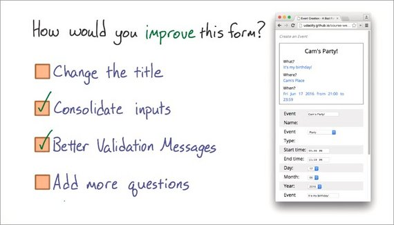
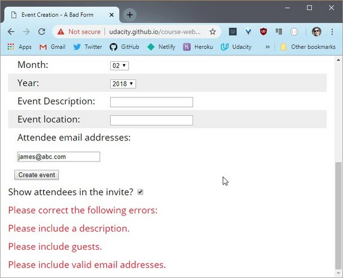
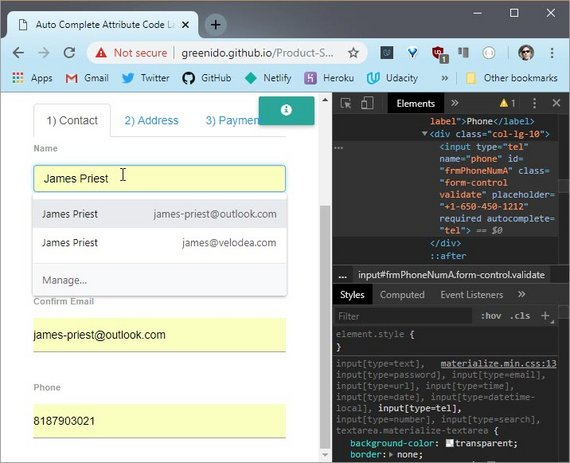
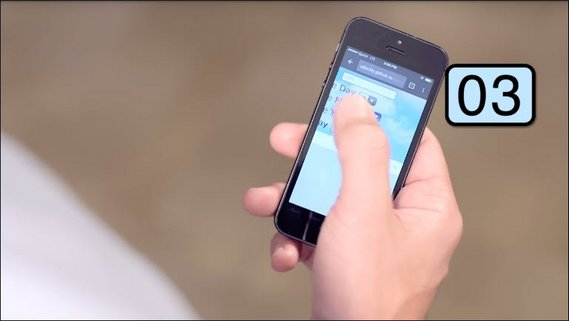
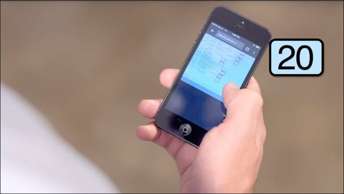
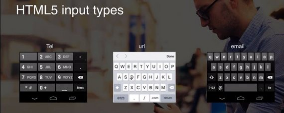
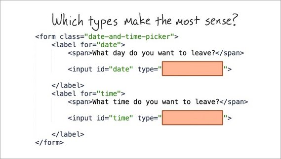
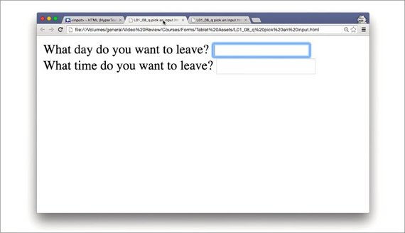

<!-- markdownlint-disable MD022 MD032 -->
<!-- # Mobile Web Specialist Nanodegree -->
# High Conversion Web Forms

[<-- back to Mobile Web Specialist Nanodegree homepage](../index.html)

### Resources
- [Create Amazing Forms by Pete LePage](https://goo.gl/i0vY1M) - input types, datalist, labels, autocomplete attributes, autofill pitfalls, real-time validation
- [Web Forms the Right Way](https://www.slideshare.net/greenido/web-forms-the-right-way) - a deck slides detailing HTML5 Forms best practices.
- [Autocomplete example](http://greenido.github.io/Product-Site-101/form-cc-example-m3.html) - with multiple tabs and various autocomplete fields.

---

## 1. Effiecient Inputs Part 1
### 1.1 Course Intro
Hi, I'm Ido Green. I'm a Developer Advocate at Google. And I'm Cameron Pittman. I make front-end courses here at Udacity.

[](../assets/images/wf1-1.jpg)

Cameron and I want to help you a bit with the forms, because almost any meaningful experience on the webs come with boxes that need to be filled.

It might be a registration form, a shopping cart or a sign in form. All of these need simple forms. And why? Well, it's because the simpler the form is, the more conversions you're going to see.

In fact, according to Chrome usage data, you can make forms 30% faster by just making them ready to autofill. We will dive into it in the second lesson. For now, just remember that with faster forms comes happier users and more conversion.

This course is all about best practices for designing and developing forms. We want you to build forms that work great for all your users, no matter their platform, mobile or desktop. However, mobile platforms are a bit more of a challenge due to the smaller screen size. So we are going to focus on that more in this course.

Also for this course, we expect that you're a web developer who understands the fundamentals of HTML, CSS, and JavaScript. We expect that you've been building sites with forms, and you're always trying to stay up to date with best practices

In the first two lessons, you'll be learning about inputs that make up forms. All the little button and toggles that clutter your user screens.

And in the third lesson, you'll take on forms as a whole and examine what you can do to convert more users. This is especially important for e-commerce sites, but it certainly applies to any kind of long form.

In the last lesson, you'll make forms reactive and touchable for mobile users.

### 1.2 Quiz: Fix this Form
If you want to get better at building forms, you need to start critiquing forms. Many forms that look pretty reasonable are, in reality, not that great.

With that in mind, I want you to try critiquing this form. You can find [a link to it here](http://udacity.github.io/course-web-forms/project/start/create.html).

[](../assets/images/wf1-2.jpg)

This form is actually part of the final project for this course which is an event planner app.

You'll eventually have a chance to apply everything you've learned in this course, to turn this clunky app into a high conversion machine. And by the way, the version that you'll see in a few moments might look slightly different than this one. And that's simply because we might tweak it a bit between now and when you're actually taking the course.

Overall though, it should look pretty much the same. Anyway, play with his form for a moment and when you're done, I have a question for you.

How would you improve this form? Would you change the title? Would you consolidate inputs? And this means simply taking multiple inputs and turning them into one. Would you write better validation messages? Or would you add more questions? Check all that apply.

#### 1.2 Solution
I'll start at the top.

[](../assets/images/wf1-3.jpg)

Change the title? Mm, no, I wouldn't do that. Right now the title is "Create an Event", and that seems pretty straightforward, so I'll leave it alone.

Next up, consolidate inputs, definitely. Look, right now you have to select the time, the day, the month, and the year separately. And These are all really part of the same question so, I think it make sense that they're the same input. Seems like an improvement to me.

Now, what about better validation messages, definitely. Right now you have to scroll down to the bottom to see a list of errors.

[](../assets/images/wf1-4.jpg)

This could be a lot more helpful in a lot of different ways so that should definitely be improved.

Lastly, what about adding more questions? Well, you really want to minimize the number of questions you ask if you want to keep the form simple. So no, I don't think that adding more is going to improve this form.

Okay, not too bad.In the next video you'll see an interview with Luke Wroblewski who is a product director at Google. Luke is an expert on forms. You're going to here him talk about how he approaches forms as a whole. Let's watch.

### 1.3 Luke Interview Pt 1
Hi, I'm Luke Wroblewski. I'm a product director at Google, and the experience I have that's probably most relevant here is I wrote a book called Web Form Design, and in there I looked at all the little details and nuances that make forms work online.

[](../assets/images/wf1-5.jpg)

I think what you just said about thinking purposefully about forms is the key. 

Don't just treat these things as one offs that you have to do. Don't just copy a pattern and assume that it works. Actually take the time to think what are you asking people and how are you asking them that? And if you put in a little bit of effort, you'll have a lot of impact and that's kind of the whole essence of form design.

### 1.4 Good Form Design
A picture is worth a thousand words, right? So I want to show you a few examples that will help you develop the right mindset for creating better forms.

[](../assets/images/wf1-6.jpg)

On the right is an example that is good.

Notice how it is quick to finish. Notice the placeholders. The fonts are visible and big enough. Notice the progress bar.

On the left is an example that is not so good. Notice how it is hard to finish. Notice that you don't see any progress. The font is too small.

I hope you noticed the patterns that well-designed forms share. In the next video, Cam and I will summarize the principles of a well-designed forms.

### 1.5 Useful Form Principles
When building forms, you've got one main objective, getting more conversions. That's when a new visitor to your site sign up or make a purchase and nothing is more effective than making forms quick and easy to finish.

The less users have to type, the less that's in the way between them and converting. It's pretty simple. You know, in my mind the best example of a super fast form is Amazon's One Click Ordering. It's great because you're just done in milliseconds.

True, that's a fast form but it only works for some products and only if the users are already signed in. For all other situations, it pays to help out your users. Guide them with useful labels, prompts, validation, and progress indicators.

Build up their confidence and watch your conversions go up.

### 1.6 Form Fixing Strategies
While you are working to decrease the time it takes to complete the form, you've got a few options at your disposal to help out.

[](../assets/images/wf1-7.jpg)

First off, you could use your user's existing data. For example, if the user is logged into your site, and you already know their postal code because they submitted it in a earlier form, it will be nice of you to pre-fill the postal code field with a known one like you could see here.

Another option is to access the geolocation in order to determine the postal code. This works even if the user isn't logged in.

This is great because with almost no effort ,you saved your users time and you're one field closer to completion. In the date example, here it's three fields closer.

Another easy option is to enable users to automatically fill fields by enabling autofill. You will dive deep into autofill attribute by enabling Auto Complete in the next lesson.

[](../assets/images/wf1-8.jpg)

But before thinking about our attributes on your inputs, I want you to think about the input elements themselves. Just look how powerful autofill can be.

I'm just start typing here and when I'm choosing, it's automatically fill the form.

[](../assets/images/wf1-9.jpg)

Here's a [link to the autocomplete example](http://greenido.github.io/Product-Site-101/form-cc-example-m3.html) used in screen capture above.

### 1.7 Death to Dropdowns
You know, I'm one of those people that likes to finish something as soon as I think of it. If I think about something like let's say picking out a flight. I'll just take out my phone and start picking dates. And I found that I pretty often encounter dropdown menus, usually for things like dates. This seems reasonable, right?

Okay, I want you to watch this counter that just popped up on your screen. It's going to count the number of taps it takes for me to search for a flight. Are you ready? Watch.

[](../assets/images/wf1-10.jpg)

Did you catch that?

Three taps to select a month. Not a great start. Here, let me finish.

[](../assets/images/wf1-11.jpg)

Did you see how many taps that took? It's ridiculous. Clearly, there must be a better input than a dropdown.

### 1.8 HTML5 Inputs
There are much better options than dropdowns.

[](../assets/images/wf1-12.jpg)

Check out the following resources

- [Create Amazing Forms by Pete LePage](https://goo.gl/i0vY1M) - input types, datalist, labels, autocomplete attributes, autofill pitfalls, real-time validation
- [Web Forms the Right Way](https://www.slideshare.net/greenido/web-forms-the-right-way) - a deck slides detailing HTML5 Forms best practices.

After watching Cam having terrible time with dropdowns, you should be asking yourself, how do I pick the right ones? How do I decide what input to pick? These are great questions.

Luckily the HTML5 standard includes a number of input types tailored for every situation.

Consider these the tools or building blocks for your forms. This should look pretty familiar. Here is on the left is the Phone input and on the right is the Email and in the middle you could see the URL. 

[](../assets/images/wf1-13.jpg)

And of course we have many more. Notice how each specialized input contains the buttons that the user needs. Nothing more, nothing less.

This is great because we don't have too much real estate on a mobile device and we want to enable our users the most convenient way to type the information they need.

In the next quizzes, Cam will challenge you to research on your own and pick the best input types for your forms.

### 1.9 Quiz: Pick an Input
This flight picker app was annoying. I was tapping way too much to pick flight dates. 

[](../assets/images/wf1-14.jpg)

This site is obviously using the wrong kinds of inputs. There's gotta be a better way. So for this quiz, I want you to think about the types of inputs you're inflicting upon your users. So you don't make the same mistakes that I did when I built this.

Here are two HTML inputs.The first input is for date and the second one is for time.

[](../assets/images/wf1-15.jpg)

What types of inputs make the most sense for these two inputs? Check out the link below to see a list of inputs on the Mozilla Developer Network.

- [Input types on MDN](https://developer.mozilla.org/en-US/docs/Web/HTML/Element/input#Form_%3Cinput%3E_types)

Do some research, and when you're done, type your answers into these boxes.

#### 1.9 Solution
On the Mozilla developer network and I have a list of inputs.

[](../assets/images/wf1-16.jpg)

I see a few relevant inputs like `date` and `datetime-local`. `datetime-local` is really useful but includes times.

Given that there's a separate input for time in this quiz, I want to go with `date`.

So I'll scroll down, and there is time. Well, that's pretty straightforward. This is what the form looks like before you enter date and time.

[](../assets/images/wf1-17.jpg)

You'll notice that these two are just defaulted to text inputs.

And then after you enter date and time for the types, you will see that now you have a nice date selector for dates, and a nice time selector for time.

[](../assets/images/wf1-18.jpg)

That looks pretty good.

### 1.10 Quiz: Datalist
Okay, so not everything about drop downs is all bad. For instance, the ability to give users a predefined list of options actually can come in handy. It's just that forcing users to scroll through massive lists of options can be tiring. And it's not very flexible because they have to pick one of the options.

[](../assets/images/wf1-19.jpg)

Incidentally, there is one kind of input that combines the helpfulness of a pre-defined list with the flexibility of a text input, and it's called the datalist.

Here's an example. 

[](../assets/images/wf1-20.jpg)

With the data list, you still get a pre-defined list of options, but users also have the ability to type. And as users type, they will see options from the list get suggested. But this doesn't mean that users have to use one of the options. They can actually type in a different value.

This makes data lists a nice, flexible solution. The syntax is pretty simple. Rather than putting options in a select tag, put them in a data list tag.

Each option should have a value set to whatever value you want it to take, and you'll need to give the data list an `id`. The input should have a `list` attribute, and the `list` attribute should match the datalist `id`.

[](../assets/images/wf1-21.jpg)

You can find out more about the data list on MDN

- [Datalists on MDN](https://developer.mozilla.org/en-US/docs/Web/HTML/Element/datalist)

For this quiz you're going to be building the data list you just saw. I'll be giving you a version of the demo with a dropdown, and you'll be turning it into this.

[](../assets/images/wf1-22.jpg)

#### 1.10 Solution
Turn this dropdown into a datalist!

##### Select
Here's where the code starts. There's a select tag indicating that this is a drop down and there are a few options inside.

```html
<!DOCTYPE html>
<html lang="en">
<head>
    <meta charset="UTF-8">
    <title>Quiz - Datalists</title>
</head>
<body>
    <p>What kind of event are you hosting?</p>
    <select>
        <option>Party</option>
        <option>Meeting</option>
        <option>Conference Talk</option>
        <option>Sports Game</option>
    </select>
</body>
</html>
```

##### Datalist
And this is what it looks like as a datalist.

```html
<!DOCTYPE html>
<html lang="en">
<head>
    <meta charset="UTF-8">
    <title>Quiz - Datalists</title>
</head>
<body>
    <label for="event">What kind of event are you hosting?</label>
    <input id="event" name="event" list="event-items">
    <datalist id="event-items">
        <option value="Party">
        <option value="Meeting">
        <option value="Conference Talk">
        <option value="Sports Game">
    </datalist>
</body>
</html>
```

The differences are pretty minimal. The `select` tag turned into a `datalist` tag. I added a `list` attribute to the `input` with the same `id` as the `datalist`. And I changed all the option values from inert HTML text to values.

Next up, you're going to watch the next part of the interview with Luke. This time, he'll be talking about what makes a perfect form.

### 1.11 Luke Interview Pt 2
[](../assets/images/wf1-5.jpg)

The perfect form is no form, right? Nobody wants to fill in forms. And I mentioned before, I wrote a book about web forms. The first two words in the book are "forms suck". Which is very true.

Nobody wants to go through that process of filling in a form. They want what's on the other side. They want that ride from Uber. They want the book from Amazon. They don't want to sit there retyping their name for the bizillonth time. And ultimately it's almost an insult to the person.

Technology is supposed to change the world, but the damn computer doesn't even remember what my name is? How many times must I type my name into the same freaking computer before it knows who I am?

Like I said, it's almost insulting to people to treat them that way. So my ultimate example of the best form is no form. And that's why I like these things that get you down to a single tap or something where you can just instinctively say, I want that and get what you want.

We are a long ways away from that, in any case, but there are a couple examples, which was very promising. And, usually, that's how things start. Or you'll see one or two examples that people say, oh, that's not achievable, but gradually more and more people get to that point and it becomes the new norm.

### 1.12 Lesson Outro
You know, there are other ways to predict what your users will want to type. For instance, if you already have your users relevant data, why not just prefill the form for them? It's easy enough.

Even if your users aren't logged in, you can still help them out. For example, you could guess their location using location services. See links below.

- [Ido's CodePen Geolocation Example](http://codepen.io/greenido/pen/qOEbGp)
- [HTMLRocks Geolocation Example](https://www.html5rocks.com/en/tutorials/geolocation/trip_meter/)


In the end, this is all in the pursuit of the most important principles to takeout from this lesson. Speed equals conversions.

This lesson got you thinking about fast, efficient inputs, but you are just getting started. In the next lesson, you'll dive into other time-saving tricks, like creating inputs that support autofill and validation.
