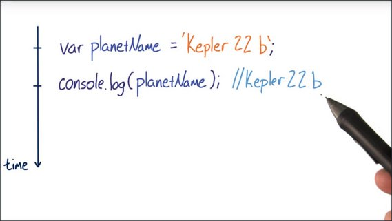
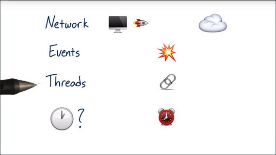
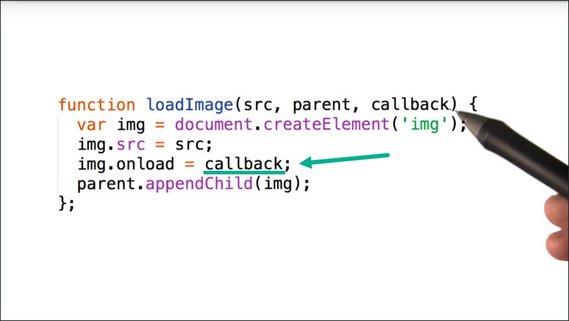
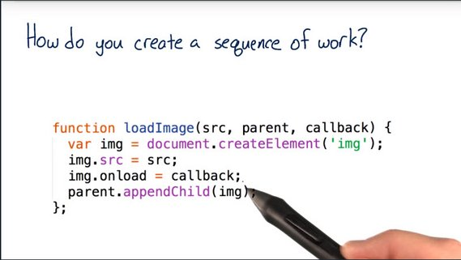
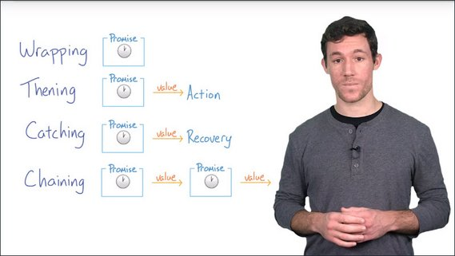
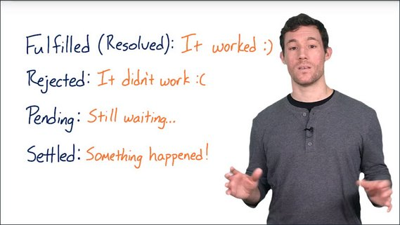
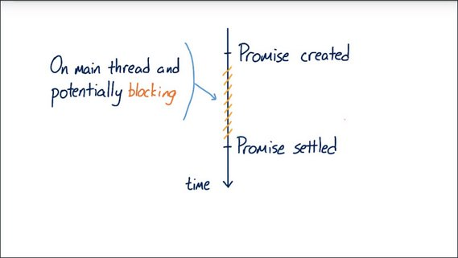
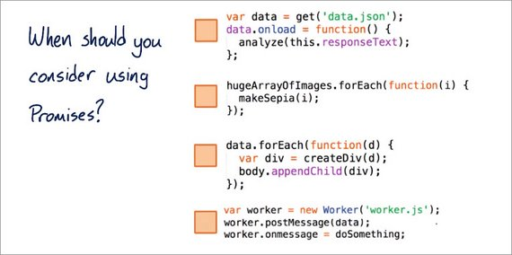

<!-- markdownlint-disable MD022 MD024 MD032 -->
<!-- # Mobile Web Specialist Nanodegree -->
# JavaScript Promises

[<-- back to Mobile Web Specialist Nanodegree homepage](../index.html)

---

### Supporting Links
- [JavaScript Promises - Jake Archibald](https://developers.google.com/web/fundamentals/primers/promises) - Google Web Fundamentals

## Lesson 1. Creating Promises
### 1.1 Course Introduction
Hi everybody, I'm Cameron Pittman. Welcome to this short course on JavaScript promises.

Every web developer needs to be able to handle asynchronous work with confidence and ease, and that's why you're here. You're here to take advantage of native JavaScript promises.

There are many methods to handle asynchronous work already. However, as you'll be discovering in this course, promises are the recommended option, because they give you flexibility,intuitive syntax, and easy error handling.

But before we start all that, I have an off topic question for you.

You're looking at millions of stars in the disk of our Milky Way galaxy.

Every dot is a star. Some are bigger and brighter than the sun, others smaller and dimmer. But what else is in this picture? Planets.

Every single star in the Milky Way is the possible home for dozens of alien worlds. That means it's likely that there are hundreds of billions of planets in our galaxy alone.

The Kepler Space Observatory has found more than 1,000 exoplanets like this one in the last few years. Combined with data from other telescopes, astronomers have confirmed sightings of almost 2,000 exoplanets.That's a lot of worlds.

I had an idea when I was designing this class, andI call it the Exoplanet Explorer. It's a web app that helps people learn about real planets around other stars.

Throughout this class, you'll be using promises to request real JSON data about exoplanets, and that data is coming from NASA and CalTech.

You'll be using promises to turn that data into useful information in the app. Are you ready to get started?

### 1.2 Callbacks vs Promises
> "The Promise object is used for deferred and asynchronous computations." 
> -MDN

Okay, great. This statement is less than helpful if you're understanding of the word asynchronous is less than certain.

So, the question is, what is asynchronous work?

Asynchronous work happens at an unknown or unpredictable time.

Normally code is synchronous. One statement executes, like this one, and there's a guarantee that the next statement executes immediately afterwards.

Threading on processors doesn't necessarily guarantee that, however, the JavaScript threading model ensures that, for all intents and purposes, JavaScript runs in a single timeline.

Unlike synchronous code. Asynchronous code is not guaranteed to execute in a single unbroken timeline.

In fact, you should assume that you have no idea when asynchronous operations will complete.

In a situation like this, for example, you can't even assume that just because you sent out the first request first and the second request second, that the first request will return sooner than the second.

Assume that either order is equally likely, as the fact that one or both requests just might fail altogether.

Network requests aren't the only examples of asynchronous code. Any code that relies on processes like these, like events, like threads, or just some kind of unknowable finishing time are asynchronous.

So, the big question is, what is the best way to handle asynchronous code?

Okay, the answer is obviously promises. That's why you're here.

### 1.3 Callbacks vs Thens
Callbacks are the default JavaScript technique for asynchronous work. Pass the function to another function, and then call the callback function at some later time when some conditions have been met.

This works well but there are some questions without obvious answers. For instance, how do you handle errors?

It's best practice to assume that any operation could fail at any time. It's doubly important to assume so with network requests.

If an error occurs on line #2, should you still execute the call back? If so, what value should it receive? If not, then what should happen?

What if it's a JavaScript error? Should that be handled any differently than a network error?
There's no clear answer.

Node.js basically makes error first callbacks mandatory but that doesn't really solve the problem. It's still basically your job to define, and implement an error handling strategy.

Assume that everything happened just fine, no errors and then this callback runs when the onload handler gets called.

Great. Now you've chained together two pieces of work, but what if this callback is also an asynchronous operation and you need something else to happen afterwards? Do you pass another function with another callback here?

This is one scenario that leads to something called the Pyramid of Doom. A dreadful situation where there are nasty, nasty nested callbacks within callbacks, within callbacks.

This looks ugly and it's hard to write, but the real sin is that it is incredibly frustrating to debug.

This is the same kind of code, but written with promises, and my, it looks nicer.

You'll be learning all about the beauty of `.then` later in this course. For now, just read this and appreciate the fact that you can figure out what's happening here, despite the fact that you haven't even finished this course.

That's pretty awesome.

### 1.4 Course Map
I broke this course into four stages that built on one another.

You'll start in the **Wrapping** stage where you'll be learning the syntax of constructing promises.

A promise constructor in and of itself isn't super useful. So from there, you'll be learning how to react the resolution of the promise.

If all goes well, you'll want to `.then` off the promise, or if something breaks, you'll want to `.catch` the error, these are the **Thening** and the **Catching** stages.

You'll spend the whole second lesson in the **Chaining** stage where you'll learn how to create long sequences of asynchronous work.

It's also worth going over some promise vocabulary. I'm stealing these definitions from Jake Archibald who wrote a fantastic [guide on promises](http://www.html5rocks.com/en/tutorials/es6/promises/) that you can find in the Resources section below.

There are four states a promise can have. You'll pick up these terms pretty quickly, but I recommend jotting them down on a piece of paper to help out as you're going through the course.

Here they are.

- **Fulfilled (Resolved):** - It worked :)
- **Rejected:** - It didn't work :(
- **Pending:** - Still waiting...
- **Settled:** - Something happened

The first one is **fulfilled**, and that means that the action related to the promise succeeded, this state is also known as resolved.

Then there is **rejected**, this means that the action related to the promise failed.

The next one is **pending**, which means that the promise has not yet fulfilled or rejected.

And then finally, there's **settled**, which means that the promise has either fulfilled or rejected.

Okay, now that you've got the terms behind promises and you know where we're going in the course, it's time to examine how and when promises are executed.

#### Resources

- [JavaScript Promises - Jake Archibald](http://www.html5rocks.com/en/tutorials/es6/promises/)

### 1.5 Promises Timeline
I want you to imagine a situation like this, where you're setting an Event listener after the event has already fired.

What happens? Nothing.

If the event doesn't fire again, the Event listener never gets called.

Now imagine you're using promises and you set an action to occur for when a Promise resolves which is set after the promise has already resolved.

Guess what? This will execute.

Compare this to Event listener example where the Event listener would never get called if it's set after the event already fired.

I want to quickly show you some code.

This is a promise constructor, and you'll be learning more about this in the next video. This method `resolve()`, settles the promise.

A promise can only settle once. So in this scenario, the second resolve is doing nothing. Nothing's going to happen, it's going to go by unnoticed.

Compare this to events. An event can fire many times, but a promise can only settle once.

Promises execute in the main thread, which means that they are still potentially blocking.

If the work that happens inside the promise takes a long time, there's still a chance it could block the work the browser needs to do to render the page.

If so, the frame rate of your app is going to suffer, and you'll probably hear your users complain about jank.

Promises are not a pass for safely executing long running operations. They're simply a technique for deciding what will happen when an asynchronous task settles.

Think of them as `try...catch` wrappers around asynchronous work.

Okay, it's time for a quiz.

### 1.6 Quiz: Async Scenarios
In which of these situations should you consider using Promises?

1. Should you consider using Promises when you're working with information from an Ajax request?
2. Should you use them when you're executing long-running image manipulation in the main thread?
3. Should you use them when you're creating a series of divs and appending them to the body in a specific order?
4. Should you use them when you're posting messages back and forth between the main thread and a web worker. If you're not familiar with web workers, it's an API that allows you to create independent threads to execute long running JavaScript off the main thread.

There's more than one answer, so check all that apply.

#### Solution
So, which of these scenarios are right to be promisified? I'll go ahead and start at the top.

1. [x] Working with information from ajax requests.

    Most definitely. The word asynchronous is in the very definition of ajax, and you'll be working with these kinds of requests soon.

2. [ ] Executing long running image manipulation work in the main thread.

    No. Promises run in the main thread, so you don't gain anything from wrapping work in the main thread in a promise. The work will still happen synchronously and still probably lead to a janky experience.

3. [ ] Creating a series of HTML elements.

    No. Creating and appending DOM elements is synchronous, so there's no need to wrap them in promises. That being said, if these were, say image elements, or script elements with links to external resources, then loading the external resources themselves, are asynchronous operations. You could use promises to chain actions after the resources load. Likewise, if the data came from an asynchronous resource, then you could wrap this in a promise, but that's not what's happening here.

4. [x] Posting messages back and forth between the main thread and a web worker.

    Yes. Web workers run on separate threads and post data to the main thread. They are certainly asynchronous and perfect for promises.

All right, that's enough discussion about promises. It's time to start writing them.