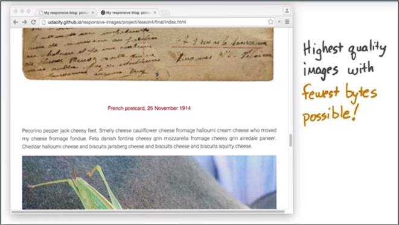
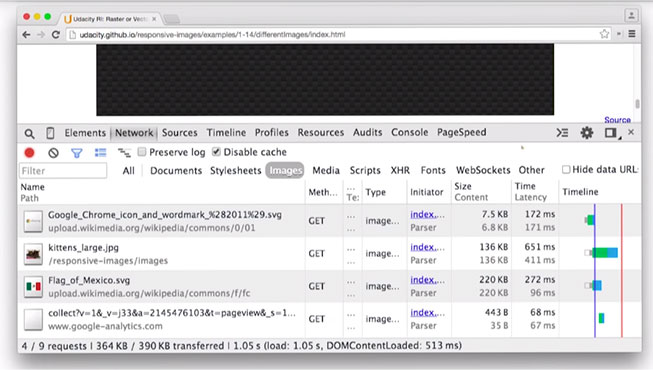
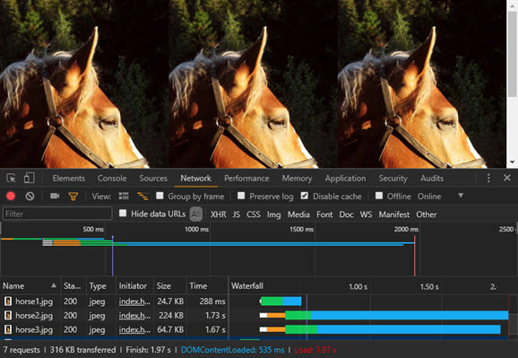
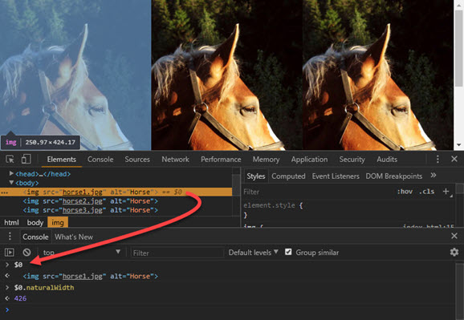

<!-- markdownlint-disable MD022 MD032 -->
<!-- # Mobile Web Specialist Nanodegree -->
# Responsive Images

[<-- back to Mobile Web Specialist Nanodegree homepage](../index.html)

---

### Supporting Links
- [Google's overview of Chrome DevTools](https://developers.google.com/web/tools/chrome-devtools/)

## Lesson 6. Getting Up and Running
### 6.1 Course Introduction
Sam Dutton, a developer advocate at Google, and Cameron Pittman, a course developer at Udacity, teach this course on how to use images responsively so they work across a variety of devices, display sizes, and connectivity scenarios.

The web started as a text only medium. It was limited, but the ability to embed images was the innovation that really made it take off. Now we have an incredible wealth of images on the web.

Given the huge and increasing variety of devices and contexts for consuming web content now, we need to think about how we use images.

Throughout this class you'll be building a webpage design for a blog site that uses several kinds of images. By the end you'll be able to incorporate these techniques in your work.

### 6.2 Why Responsive Images
On mobile, we need to be extra careful because images consume more than 60% of the bandwidth used to open a web page. That's bandwidth we can't always rely on or might not want to use.

Also, images don't always work so well on different screen sizes if we don't take steps to make the image responsive.

The web was actually invented with responsiveness in mind to enable us to publish content to a variety of devices.

> "Create a product, don't re-imagine one for small screens. Great mobile products are created, never ported."
>
> -- Brian Fling

Great designers don't optimize for mobile as an afterthought, they think responsively from the get go in order to build sites that work across a range of devices.

### 6.3 Intro to Project
As the course continues, you'll have a chance to practice by working on this blog.

You'll start with the ugly version and turn it into something that looks much more reasonable.

There's some aspects of art that go into this. So, your finished version may look slightly different than ours.

Regardless, it's our goal that working on this blog will help you easily deliver the highest quality images with the fewest bytes possible.

### 6.4 Setting Up Your Environment
In this course, you'll be using Google Chrome and Chrome's developer tools, which we call DevTools for short.

You can use DevTools to quickly get an idea of how your site performs on a range of different devices. However, emulators and simulators can never really replace the experience of using a real phone or tablet.

To test your work on a phone or tablet, you'll need to make sure you're set up to use remote debugging.

For the remainder of this lesson, you will be getting some instructions from Peter Lovers on how to get started with mobile DevTools and debugging on your mobile devices.

### 6.5 Setup for mobile
Here are two useful links

- [Download Chrome Canary](https://www.google.com/chrome/browser/canary.html)
- [Remote debugging Android devices with Chrome](https://developers.google.com/web/tools/chrome-devtools/debug/remote-debugging/remote-debugging?hl=en)

#### What is Chrome Canary and why should I use it
Chrome Canary is the developer version of Chrome. It looks and acts like the regular Chrome browser, but it includes new and experimental features that haven't been released yet. We recommend analyzing websites with Canary to take advantage of the latest tech. However, be warned that Canary isn't guaranteed to be stable, so expect crashes and occasional bugs.

#### Do I have to test on mobile
For the purposes of this course, no. But testing your websites on mobile is a best practice, and if you have the means to do so we highly recommend it.

### 6.6 Using DevTools on mobile
Open Chrome on your development machine and go to `chrome://inspect`.

Make sure the site you want to debug is open on your mobile device and then connect your laptop to your mobile device via USB. Then confirm that you want to allow USB debugging.

Back in our development machine, we can see a list of the attached devices and the Chrome tabs that are open on the devices. You can open other tabs, focus on specific tabs, reload a tab and even close a tab.

You can inspect the pages that are running on your mobile device, from your development machine, and using screen-cast mode, you can drive the experience on your mobile device from your development machine.

Clicking on links will update simultaneously on the device and the desktop.

### 6.7 Mobile Tools for iOS
iOS WebKit Debug Proxy: [https://github.com/google/ios-webkit-debug-proxy](https://github.com/google/ios-webkit-debug-proxy)

Please note that on the forums, there is a discussion continuing about ios-webkit-debug-proxy. Depending on your version of canary, if you're using it, it might take a lot of time and some students suggest trying Safari Dev Tools and point to links like this:

[https://www.smashingmagazine.com/2014/09/testing-mobile-emulators-simulators-remote-debugging/](https://www.smashingmagazine.com/2014/09/testing-mobile-emulators-simulators-remote-debugging/)

Remember you can run in simulator mode in Chrome Dev Tools.

### 6.8 Lesson Wrap Up
Now that you've got your environment set up, you're ready to start developing with responsive images in mind.

In the next lesson, you'll start experimenting with image sizing, compression, and formats. By the end, you'll be ready to intelligently reduce the number of bytes required for your images.

## Lesson 7. Units, Formats, Environments
### 7.1 Quiz: Sizing Intro
By the end of this lesson, you will be prepared with a workflow that will make it easy for you to optimize your images so that they take up as little bandwidth as possible while still looking great.

You'll be thinking about image quality and size. With images on the web, it all comes down to size, but what does that actually mean?

Here's a question for you.Can you spot the differences between these three images? 

To be honest, I can't tell the difference with my eye. These three look the same to me.

For this quiz, check out [this site](http://udacity.github.io/responsive-images/examples/1-05/identicalImagesDifferentCompressionAndSize/index.html), then use DevTools to work out the difference between the three images.

Are the differences caused by compression level, display resolution, the natural resolution, or the file type? Check all that apply.

If the image data looks the same for all images, make sure to check the `Disable cache` checkbox in DevTools.

#### Answer
I've opened up DevTools, and I've navigated to the Network tab. I'm ready to record so I will refresh the page. You can see the three requests for the three different images, horse1, horse2, and horse3. It looks like their sizes are really different.

Notice how horse2 is almost ten times bigger than horse1, and horse3 is also bigger than horse1. Given that the images look identical, it seems like there could be some wasted bytes here.

Inside the Elements pane, I can find out the actual dimensions of these three images. There are a couple of ways doing it. I'm going to show you a hard way and then an easy way.

DevTools has this awesome feature where you can manipulate an element in the DOM by clicking on it. So I've clicked on the first horse. Then inside the console, I can access it by typing `$0`.

When I press Enter, the horse `` element is returned. To find out the horse's actual width, I'll simply access the property `naturalWidth`. When I do that, the width returned is `426`.

I then select horse2 and run the same command to see that one is also 426 pixels wide. So I'll try the third one.And ah-ha that one is twice as large at 852 pixels. So it looks like these three images have different sizes.

Okay, now here's the easy way of figuring that out. Simply hover over the image, and you can see it right here. There is the natural width and height.Horse2 is the same just like we saw a second ago.And then horse3 is twice as large.

So then what could be different about horse1 and horse2?

As it turns out, their compression levels are different. So at this point it's clear that horse3 is definitely a larger image but then what's different about horse1 and horse2?

If they have the same resolution but different sizes, then they have different compression levels. So, the answer to this quiz is that they have different compression levels and different resolutions.

- [x] Compression level
- [ ] Display resolution
- [x] Actual (natural) resolution
- [ ] File type

<!--  
## Lesson 7. Units, Formats, Environments

## Lesson 8. Images with Markup

## Lesson 9. Full Responsiveness -->