<!-- markdownlint-disable MD022 MD032 -->
<!-- # Mobile Web Specialist Nanodegree -->
# Responsive Images

[<-- back to Mobile Web Specialist Nanodegree homepage](../index.html)

---

### Supporting Links
- [Google's overview of Chrome DevTools](https://developers.google.com/web/tools/chrome-devtools/)

## Lesson 6. Getting Up and Running
### 6.1 Course Introduction
Sam Dutton, a developer advocate at Google, and Cameron Pittman, a course developer at Udacity, teach this course on how to use images responsively so they work across a variety of devices, display sizes, and connectivity scenarios.

[](../assets/images/full-size/ri6-1.png)

The web started as a text only medium. It was limited, but the ability to embed images was the innovation that really made it take off. Now we have an incredible wealth of images on the web.

Given the huge and increasing variety of devices and contexts for consuming web content now, we need to think about how we use images.

Throughout this class you'll be building a webpage design for a blog site that uses several kinds of images. By the end you'll be able to incorporate these techniques in your work.

### 6.2 Why Responsive Images
On mobile, we need to be extra careful because images consume more than 60% of the bandwidth used to open a web page. That's bandwidth we can't always rely on or might not want to use.

Also, images don't always work so well on different screen sizes if we don't take steps to make the image responsive.

The web was actually invented with responsiveness in mind to enable us to publish content to a variety of devices.

> "Create a product, don't re-imagine one for small screens. Great mobile products are created, never ported."
>
> -- Brian Fling

Great designers don't optimize for mobile as an afterthought, they think responsively from the get go in order to build sites that work across a range of devices.

### 6.3 Intro to Project
As the course continues, you'll have a chance to practice by working on this blog.

[](../assets/images/full-size/ri6-2.png)

You'll start with the ugly version and turn it into something that looks much more reasonable.

There's some aspects of art that go into this. So, your finished version may look slightly different than ours.

Regardless, it's our goal that working on this blog will help you easily deliver the highest quality images with the fewest bytes possible.

### 6.4 Setting Up Your Environment
In this course, you'll be using Google Chrome and Chrome's developer tools, which we call DevTools for short.

[](../assets/images/full-size/ri6-3.png)

You can use DevTools to quickly get an idea of how your site performs on a range of different devices. However, emulators and simulators can never really replace the experience of using a real phone or tablet.

[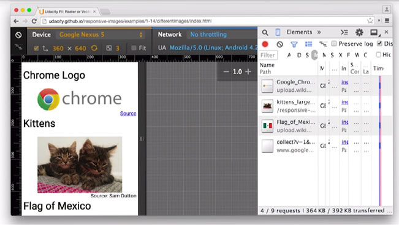](../assets/images/full-size/ri6-4.png)

To test your work on a phone or tablet, you'll need to make sure you're set up to use remote debugging.

For the remainder of this lesson, you will be getting some instructions from Peter Lovers on how to get started with mobile DevTools and debugging on your mobile devices.

### 6.5 Setup for mobile
Here are two useful links

- [Download Chrome Canary](https://www.google.com/chrome/browser/canary.html)
- [Remote debugging Android devices with Chrome](https://developers.google.com/web/tools/chrome-devtools/debug/remote-debugging/remote-debugging?hl=en)

#### What is Chrome Canary and why should I use it
Chrome Canary is the developer version of Chrome. It looks and acts like the regular Chrome browser, but it includes new and experimental features that haven't been released yet. We recommend analyzing websites with Canary to take advantage of the latest tech. However, be warned that Canary isn't guaranteed to be stable, so expect crashes and occasional bugs.

#### Do I have to test on mobile
For the purposes of this course, no. But testing your websites on mobile is a best practice, and if you have the means to do so we highly recommend it.

### 6.6 Using DevTools on mobile
Open Chrome on your development machine and go to `chrome://inspect`.

Make sure the site you want to debug is open on your mobile device and then connect your laptop to your mobile device via USB. Then confirm that you want to allow USB debugging.

Back in our development machine, we can see a list of the attached devices and the Chrome tabs that are open on the devices. You can open other tabs, focus on specific tabs, reload a tab and even close a tab.

[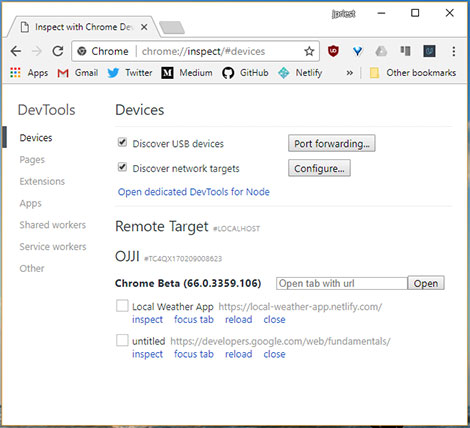](../assets/images/full-size/rwdf4.png)

You can inspect the pages that are running on your mobile device, from your development machine, and using screen-cast mode, you can drive the experience on your mobile device from your development machine.

Clicking on links will update simultaneously on the device and the desktop.

### 6.7 Mobile Tools for iOS
iOS WebKit Debug Proxy: [https://github.com/google/ios-webkit-debug-proxy](https://github.com/google/ios-webkit-debug-proxy)

Please note that on the forums, there is a discussion continuing about ios-webkit-debug-proxy. Depending on your version of canary, if you're using it, it might take a lot of time and some students suggest trying Safari Dev Tools and point to links like this:

[https://www.smashingmagazine.com/2014/09/testing-mobile-emulators-simulators-remote-debugging/](https://www.smashingmagazine.com/2014/09/testing-mobile-emulators-simulators-remote-debugging/)

Remember you can run in simulator mode in Chrome Dev Tools.

### 6.8 Lesson Wrap Up
Now that you've got your environment set up, you're ready to start developing with responsive images in mind.

In the next lesson, you'll start experimenting with image sizing, compression, and formats. By the end, you'll be ready to intelligently reduce the number of bytes required for your images.

## Lesson 7. Units, Formats, Environments
### 7.1 Quiz: Sizing Intro
By the end of this lesson, you will be prepared with a workflow that will make it easy for you to optimize your images so that they take up as little bandwidth as possible while still looking great.

You'll be thinking about image quality and size. With images on the web, it all comes down to size, but what does that actually mean?

Here's a question for you.Can you spot the differences between these three images? 

[](../assets/images/full-size/ri7-1.png)

To be honest, I can't tell the difference with my eye. These three look the same to me.

For this quiz, check out [this site](http://udacity.github.io/responsive-images/examples/1-05/identicalImagesDifferentCompressionAndSize/index.html), then use DevTools to work out the difference between the three images.

Are the differences caused by compression level, display resolution, the natural resolution, or the file type? Check all that apply.

If the image data looks the same for all images, make sure to check the `Disable cache` checkbox in DevTools.

[](../assets/images/full-size/ri7-2.png)

#### Answer
I've opened up DevTools, and I've navigated to the Network tab. I'm ready to record so I will refresh the page. You can see the three requests for the three different images, horse1, horse2, and horse3. It looks like their sizes are really different.

[](../assets/images/full-size/ri7-4.png)

Notice how horse2 is almost ten times bigger than horse1, and horse3 is also bigger than horse1. Given that the images look identical, it seems like there could be some wasted bytes here.

Inside the Elements pane, I can find out the actual dimensions of these three images. There are a couple of ways doing it. I'm going to show you a hard way and then an easy way.

DevTools has this awesome feature where you can manipulate an element in the DOM by clicking on it. So I've clicked on the first horse. Then inside the console, I can access it by typing `$0`.

[](../assets/images/full-size/ri7-3.png)

When I press Enter, the horse `` element is returned. To find out the horse's actual width, I'll simply access the property `naturalWidth`. When I do that, the width returned is `426`.

I then select horse2 and run the same command to see that one is also 426 pixels wide. So I'll try the third one.And ah-ha that one is twice as large at 852 pixels. So it looks like these three images have different sizes.

Okay, now here's the easy way of figuring that out. Simply hover over the image, and you can see it right here. There is the natural width and height.Horse2 is the same just like we saw a second ago.And then horse3 is twice as large.

[](../assets/images/full-size/ri7-5.png)

So then what could be different about horse1 and horse2?

As it turns out, their compression levels are different. So at this point it's clear that horse3 is definitely a larger image but then what's different about horse1 and horse2?

If they have the same resolution but different sizes, then they have different compression levels. So, the answer to this quiz is that they have different compression levels and different resolutions.

- [x] Compression level
- [ ] Display resolution
- [x] Actual (natural) resolution
- [ ] File type

### 7.2 All about Bits and Pixels
With images like photos, the total file size depends on the number of pixels multiplied by the number of bits it takes to store each pixel.

[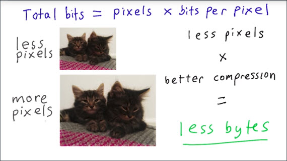](../assets/images/full-size/ri7-6.png)

So, to improve performance, you need to keep images as small as possible and compression as high as possible. It's a common mistake to save images with dimensions too large, and quality too high.

It might sound counter-intuitive, but the first rule for saving images to a range of devices is to save images with the lowest possible quality, and the smallest size as possible. But, how do you reduce file size while maintaining quality?

Throughout this course, you'll learn how to use responsive techniques to do just that.

### 7.3 Requests and Revenue
The average webpage makes a whopping 56 requests for images. Every one of those image requests has a cost in terms of page load and studies by Google, Amazon, and others have shown that even very small delays in loading pages can result in a significant loss of traffic and revenue.

[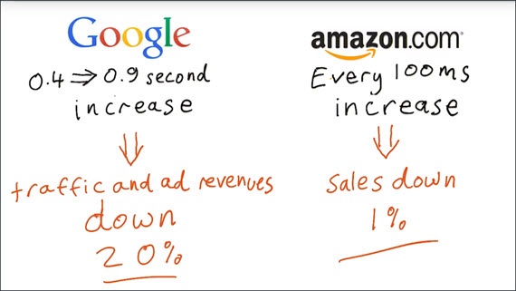](../assets/images/full-size/ri7-7.png)

Here we see from Google that a 0.4 to 0.9 second increase resulted in traffic and ad revenues down by 20% and for Amazon, every 100 millisecond increase in page load time means a loss of sales of 1%.

### 7.4 Relative Sizing
Let's have a deeper look at CSS sizing.  I've given this image a fixed size of 640 by 360 pixels, which is the natural size of the image.It looks great. But of course, when I resize the window,the image gets cropped.

[](../assets/images/full-size/ri7-8.png)

On a phone, the image is larger than the view port.Which means that to see the whole image, you have to scroll horizontally.

Let's try relative sizing. I set the image width to 100%.

It looks good in the smaller browser window and looks good on the phone, but when I resize the image larger by resizing the browser window, it starts to get pixelated and blurry.

[](../assets/images/full-size/ri7-9.png)

Let's do something about that. If we set the max-width of the image to 100%, the image will expand nicely, but only ever as wide as its natural width.

[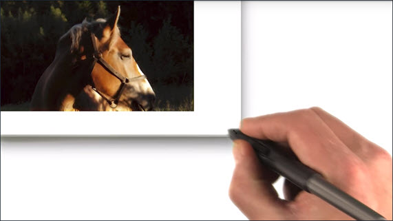](../assets/images/full-size/ri7-10.png)

Two simple things you can learn from this. For devices such as laptops and desktop monitors.

1. Don't assume the window size is the same as the screen size 
2. Don't assume the window size will always stay the same.

- **Using `max-width` is a good way to respond gracefully to a change to a larger view port.**
- When you're thinking responsively, consider large displays as well as small.

So what if you want two images to fit side by side, no matter the size of the view port? Well, that's easy. Just use relative sizing, 50% width.

[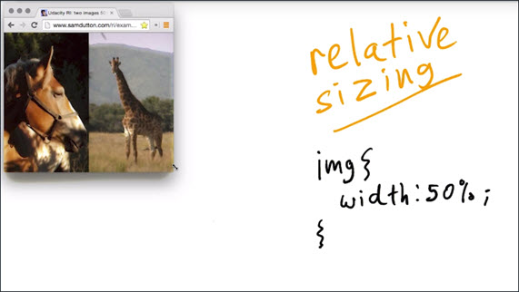](../assets/images/full-size/ri7-11.png)

But what if you want to add a ten pixel margin between the images? You can just add margin-right, 10 pixels, right?

You can get around this with our old friend `calc()`.

Calc allows you to do simple calculations in CSS values and that's a great way to combine absolute and relative values. For example, combining a percentage width with a fixed margin.

[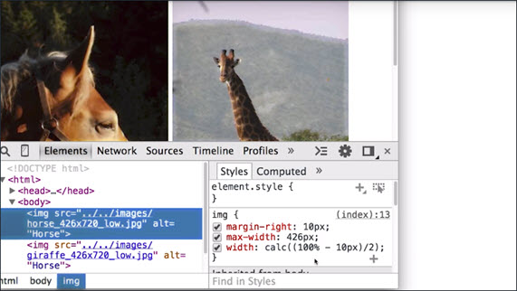](../assets/images/full-size/ri7-12.png)

Now the calculation here looks a little complex but all we're saying is to give each image half of the width available.

I've also used the `last-of-type` selector to ensure there's only a margin between the images and none to the right of the second image.

```css
img {
    margin-right: 10px;
    max-width: 426px;
    width: calc((100% - 10px)/2);
}
img:last-of-type {
    margin-right: 0;
}
```

#### Image Examples

- [Fixed size image](http://udacity.github.io/responsive-images/examples/1-07/singleImage640x360/)
- [width: 100%](http://udacity.github.io/responsive-images/examples/1-07/singleImageNotBigEnough100pc/)
- [max width: 100%](http://udacity.github.io/responsive-images/examples/1-07/singleImageMaxWidth100pc/)
- [Two images, 50% width](http://udacity.github.io/responsive-images/examples/1-07/twoImages50pc)
- [Two images, 50% width with margin](http://udacity.github.io/responsive-images/examples/1-07/twoImages50pcWithMargin)

You can find out more about `calc()` from [Mozilla Developer Network](https://developer.mozilla.org/en-US/docs/Web/CSS/calc).

The horse and giraffe are from [lorempixel.com](http://lorempixel.com/), which provides URLs for random placeholder images. For example, [check this out](http://lorempixel.com/400/200/animals/).

### 7.5 IMPORTANT! Udacity Front End Extension
We think it's incredibly important that you get feedback on your code as you write it. So, we created the Udacity Front End Feedback Chrome extension to give you feedback on quizzes as you work on your own computer.

[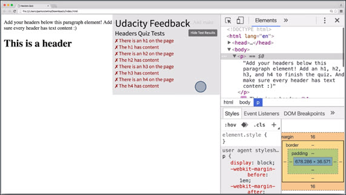](../assets/images/full-size/ri7-13.png)

This is done simply by opening up a quiz that uses the extension and clicking the extension icon in the toolbar.

#### How to Load the Extension
1. Install the Udacity Front End Feedback Extension from the Chrome Web Store or from Mozilla's Add-ons for Firefox (it's free).

2. If you're using Google Chrome, go to the Chrome extensions menu (chrome://extensions) and give the extension permission to run against file URLs.

    

3. To use the extension, open the webpage you want to edit, click on the extension icon, and check "Allow feedback on this domain":

    

4. As edits are made, changes are reflected in the Udacity Front End Feedback dialogue box.😃

<!--
### 7.6 Quiz: calc()
For this quiz I want you to fix this website.

[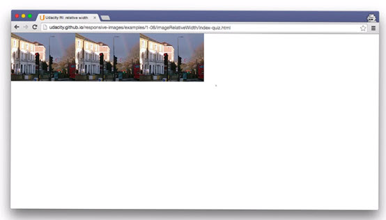](../assets/images/full-size/ri7-14.png)

You'll be trying out Calc with these images but this time, I want you to fit these three images all the way across the screen.

Each of the three images will need to be a third of the available width, and there should be a ten pixel margin between them.

Pop open DevTools and inside the head you'll find this style tag. Inside the style tag, you'll see some comments. These are the places where I want you to make some changes.

You can find a link to the website [here](http://udacity.github.io/responsive-images/examples/1-08/imageRelativeWidth/index-quiz.html).

When all three images are aligned correctly, with ten pixels between these images, a code will appear on the website. Type that code into this box to continue.

[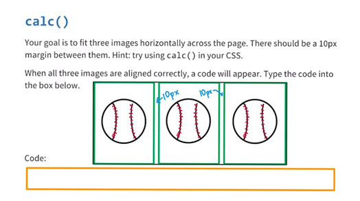](../assets/images/full-size/ri7-15.png)

#### Solution
The solution consisted of the following css:

```css
img {
    width: calc((100% - 20px)/3);
    max-width: 100%;
    margin-right: 10px;
}
img:last-of-type {
    margin-right: 0;
}
```

**Note:** There MUST be a space on each side of the `+` and `-` operators. (A space is not required around `*` and `/` as the problem is an ambiguity around negation.)

For example: `calc(100px - 10%)` **will work**. `calc(100px-10%)` **will not**.

[](../assets/images/full-size/ri7-16.png)

### 7.7 Landscape and Portrait
Let's think some more about the size and the shape of the viewport. Think about the way you use devices. Phones and tablets are often used in portrait orientation whereas a full screen browser window on a laptop is landscape.

[](../assets/images/full-size/ri7-17.png)

Now, even though you can't change the window size on a phone or tablet, these devices have another rather tricky feature when it comes to responsive resizing. Orientation can change, and when it comes to landscape and portrait, you need to think about content as well as size.

[](../assets/images/full-size/ri7-18.png)

Tall or square images can work well in portrait mode on a phone but wide images can be a real problem. Again, for responsive design the golden rule is don't assume the viewport size will always stay the same.

You'll learn the impact of image choice and art direction later in the course when you find out how to use the `<picture>` element. Later in this lesson, we'll look at ways to work with orientation using media queries.

### 7.8 vh vw vmin vmax
On the subject of sizing, there are some CSS units that you may not have heard of, but which are now really widely supported.

How about if you want an image to responsively cover the whole height of the viewport?

Now, you can always do that by setting the height of the image to 100%, but that only works if the height of the HTML and the body elements are also set to 100%.

A simple way is to use the `vh` unit, which stands for viewport height. One `vh` unit corresponds to 1% of the viewport height, and so `100vh` means 100% height.

[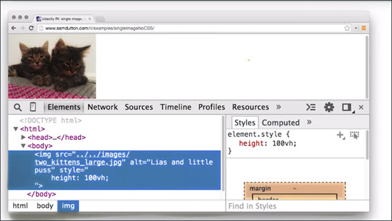](../assets/images/full-size/ri7-19.png)

You can do the same with `vw` for viewport width.

Here you can see we've set the width of the image to be `100vw`, 100% of the viewport width, and you can see that it resizes responsibly.

[](../assets/images/full-size/ri7-20.png)

Another common responsive use case is when you want an image to resize to fit the smaller of the height or the width of the viewport.

The `vmin` unit, viewport minimum, corresponds to 1% of the viewport width or height, whichever is smaller.

If you set both the width and the height to `100vmin`, you'll get the effect you're after.

[](../assets/images/full-size/ri7-21.png)

How about if you want an image to cover the whole viewport but without stretching or squashing?

For this you can use the `vmax` unit, which corresponds to 1% of the viewport width or height, whichever is greater.

So, if you set both the height and the width to `100vmax`, the image responsively resizes to cover the viewport.

[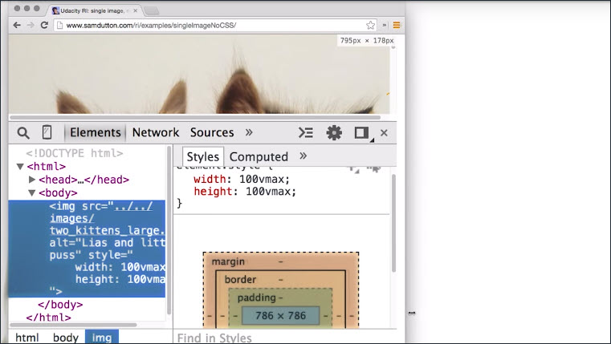](../assets/images/full-size/ri7-22.png)

**Note:** setting both the height and the width to `100vmax` or `100vmin` changes the image's aspect ratio. It'll compress your images to squares, so be careful if you want to maintain a different aspect ratio!

### 7.9 Raster and Vector
There are two fundamentally different ways to create and store images and this affects how you deploy images responsibly. Raster and vector.

**Raster images:** photographs and other images represented as a grid of individual dots of color.

Raster images might come from a camera or a scanner, or be created with the HTML `<canvas>` element.

**Vector images:** images such as logos and line art, which can be defined as a set of curves, lines, shapes, fill colors and gradients.

Vector images can be created with programs like Adobe Illustrator or Inkscape, or from using a vector format such as SVG.

SVG makes it possible to include responsive vector graphics in a webpage, and we'll talk more about this format later.

The advantage of vector file formats over raster file formats is that the browser can render a vector image at any size. After all, vector formats describe the geometry of the image; how it's constructed from lines, curves, and colors and so on, not individual dots of color.

Open the [SVG vs PNG example](http://udacity.github.io/responsive-images/examples/1-11/svgVersusPng/) in a large display - you'll see a massive difference in quality!

[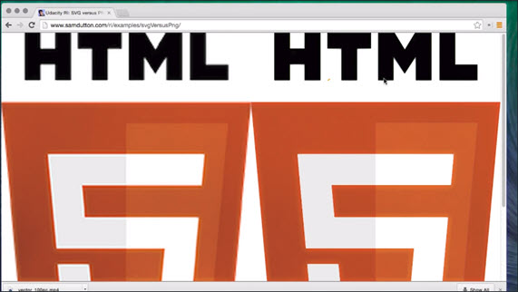](../assets/images/full-size/ri7-23.png)

Let's see what happens when we resize this page. Now, that's an SVG image on the right and a PNG on the left, and you can see as the size increases, the PNG is looking to start a little blurry, whereas the SVG is perfect at any size.

### 7.10 Quiz: Raster or Vector Banner
Imagine you're a graphic designer and you need ot design a 50m (~165ft) banner. Should you give you friend a vector or raster image? Why?

- [ ] **Vector**. File size is smaller.
- [x] **Vector**. It scales without quality loss.
- [ ] **Raster**. File size is smaller.
- [ ] **Raster**. It scales without quality loss.

Vector images can be scaled infinitely, which means that it'll be sharp and clear even on a 50m banner!

### 7.11 Quiz Raster & Vector identification
Take a look at the images in [this link](http://udacity.github.io/responsive-images/examples/1-14/differentImages/index.html). Are they **raster** or **vector** graphics?

| Image | Raster | Vector |
| --- | --- | --- |
Chrome Logo | | x |
Kitten Photo | x | |
Flag of Mexico | | x |
Repeat BG |  | x |
Gradient BG |  | x |
-->

<!--  
## Lesson 8. Images with Markup

## Lesson 9. Full Responsiveness -->