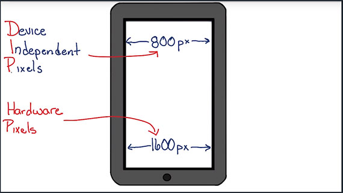
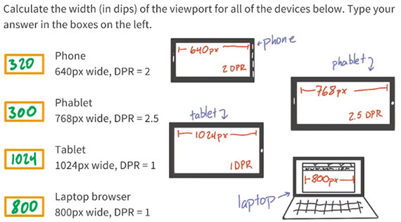
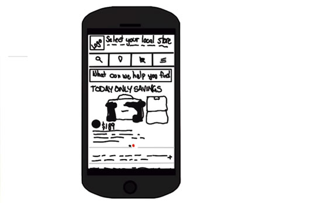

<!-- # Mobile Web Specialist Nanodegree -->

[<-- back to Mobile Web Specialist Nanodegree homepage](../index.html)

| Lesson 1 | Lesson 2 | Lesson 3 | Lesson 4 | Lesson 5 |
| --- | --- | --- | --- | --- | --- |
| Why Responsive? | Starting Small | Building Up | Common Responsive Patterns | Optimizations |

### Additional Links

- [Udacity Course - Responsive Web Design Fundamentals](https://www.udacity.com/course/responsive-web-design-fundamentals--ud893)
- [Web Fundamentals - Waht Makes a Good Mobile Site?](https://developers.google.com/web/fundamentals/design-and-ux/principles/)
- [Web Fundamentals - Responsive Web Design Basics](https://developers.google.com/web/fundamentals/design-and-ux/responsive/)
- [Web Fundamentals - Responsive Design Patterns](https://developers.google.com/web/fundamentals/design-and-ux/responsive/patterns)
- [Chrome DevTools](https://developers.google.com/web/tools/chrome-devtools/)
- [MDN - meta Viewport tag](https://developer.mozilla.org/en-US/docs/Mozilla/Mobile/Viewport_meta_tag)

## 1. Why Responsive?
Pete LePage, a developer advocate at Google, and Cameron Pittman, a front end course developer at Udacity, discuss the advantage of Responsive Web Design. 

[](../assets/images/full-size/rwdf1.png)

They are teaching this course to help us create websites that look and feel great across every device. We'll learn basic guidelines that make sites look great across a wide range of devices in use today.

### 1.1 Sites on Mobile
What does a site like Google News ([https://news.google.com/](https://news.google.com/)) do meet this challenge? They employ two different strategies; a fully responsive version for phones and tablets, and a second version for desktops that starts at a medium size.

This works well for them but adds an extra layer of complexity and work to keep things up to date.

A second example is a site like Skinny Ties ([https://skinnyties.com](https://skinnyties.com)) which is designed to be fully responsive across all devices, laptops, & desktops. This is Pete's preferred way of building sites because it'll remain adaptive for any device now or in the future.

### 1.2 What is a responsive site?
A responsive site adapts its layout to fit the space available. This means that we only have to deal with a single codebase when building and maintaining our site. When we resize a window, the content reflows to fit the smaller viewport.

### 1.3 Intro to Project
The Brighton Times news site is currently **not** responsive. We'll be challenged to improve the site's responsiveness at the end of:

- Lesson 2
- Lesson 4
- Lesson 5

There is no one right solution.

> "Responsive Web Design is an art, not a science!"

To improve responsive design skill will require practice. During this course they'll talk through the code design decisions they made but they don't expect our answers to be the same.

This course is about *thinking* responsively; about approaching responsive design from the right mindset.

Cameron talks about redesigning his own site after having put this course together. He says it may not be the prettiest but is completely responsive and it took him only a couple hours over the weekend.

[](../assets/images/full-size/rwdf2.png)

What was key in that he approached responsiveness systematically from the start instead of just as an afterthought!

### 1.4 Pan, Zoom, Touch... Ick!
Requiring your users to pinch, zoom, & pan provides a horrible user experience (UX).

The mobile market is growing faster than any other market and if you're a web developer and not building for mobile devices, you're just going to lose all of your users.

That's the core concept behind responsive design: make your content work across any device.

### 1.5 Emulators, Simulators, & Real Devices
Since we can't physically test our code on each and every device, we can use emulators and simulators to get the job done.

Chrome has a built-in emulator that should work just fine. There is also an iOS simulator and cloud-based services such as [BrowserStack](http://www.browserstack.com/).

### 1.6 Setting up Chrome's DevTools
Open up Chrome Developer Tools, using Cmd+Option+J, or Control+Alt+J. Next, hit the emulator button which is that phone looking icon in the toolbar.

The emulator is ready to go.

[](../assets/images/full-size/rwdf3.png)

I can start loading pages and see how they look, but before I do, I like to dock the tools to the right side of the browser window. Since most phones are viewed in portrait, docking to the right side gives me the most amount of vertical space.

### 1.7 Remote Debugging Intro
Remote debugging on an actual device is important to be able to do. The following will display some resources for this.

### 1.8 Setup for mobile
Here are two useful links

- [Download Chrome Canary]()
- [Remote debugging Android devices with Chrome]()

#### What is Chrome Canary and why should I use it?
Chrome Canary is the developer version of Chrome. It looks and acts like the regular Chrome browser, but it includes new and experimental features that haven't been released yet. We recommend analyzing websites with Canary to take advantage of the latest tech. However, be warned that Canary isn't guaranteed to be stable, so expect crashes and occasional bugs.

#### Do I have to test on mobile?
For the purposes of this course, no. But testing your websites on mobile is a best practice, and if you have the means to do so we highly recommend it.

### 1.9 Using DevTools on mobile
Open Chrome on your development machine and go to `chrome://inspect`.

Make sure the site you want to debug is open on your mobile device and then connect your laptop to your mobile device via USB. Then confirm that you want to allow USB debugging.

Back in our development machine, we can see a list of the attached devices and the Chrome tabs that are open on the devices. You can open other tabs, focus on specific tabs, reload a tab and even close a tab.

[](../assets/images/full-size/rwdf4.png)

You can inspect the pages that are running on your mobile device, from your development machine, and using screen-cast mode, you can drive the experience on your mobile device from your development machine.

Clicking on links will update simultaneously on the device and the desktop.

### 1.10 Mobile Tools for iOS
iOS WebKit Debug Proxy: [https://github.com/google/ios-webkit-debug-proxy](https://github.com/google/ios-webkit-debug-proxy)

Please note that on the forums, there is a discussion continuing about ios-webkit-debug-proxy. Depending on your version of canary, if you're using it, it might take a lot of time and some students suggest trying Safari Dev Tools and point to links like this:

[https://www.smashingmagazine.com/2014/09/testing-mobile-emulators-simulators-remote-debugging/](https://www.smashingmagazine.com/2014/09/testing-mobile-emulators-simulators-remote-debugging/)

Remember you can run in simulator mode in Chrome Dev Tools.

### 1.11 Lesson Summary
In this lesson, you have learned about responsive design, why it's so important, and you've got the tools to get started developing.

In the next lesson, you will break down the basic components of responsive design, like

- the viewport
- element sizes
- tap targets

At the end of the lesson, we'll have a chance to apply what you've learned as you work on the hometown site.


## 2. Starting Small
### 2.1 Defining the Viewport

In this lesson we learn how to optimize pages for different screen sizes, including the difference between **CSS** and **device-independent pixels (DIPS)** , and how to choose the right sizes for you elements.

At the end of the lesson we'll build a version of the Hometown site.

Now, when working on sites, you might notice that the content seems to flow off the page or that you have to pinch and zoom to see anything. Besides CSS, the biggest cause of this is that the **viewport** isn't set properly.

*The viewport defines the area of the screen that the browser can render content to.*

If I have an 800 pixel wide browser window and expand it to 1000 pixels wide, the viewport changes to a width of 1000 pixels.

One thing to keep in mind though is that not all displays have the same **pixel density**.

For instance, the Chromebook Pixel display reports a width of 2,560px by 1,700px, but when I make the browser window the full width and ask for the viewport width, it says its only 1280 pixels wide.

Not all pixels are created equally and sometimes a pixel isn't always a pixel.

### 2.2 Pixels, pixels, & moar pixels!
Instead of reporting the width in the number of physical hardware pixels, the browser reports the width in the number of **DIPS**, or **device independent pixels**.

[](../assets/images/full-size/rwdf5.png)

As its name implies, a *device independent pixel* is a unit of measurement that actually relates pixels to a real distance.

The idea being that a device independent pixel will take up the same amount of space on a display regardless of the pixel density of the display.

So if there are twice as many hardware pixels across as there are pixels reported by the browser, the Chromebook pixel must have a **device pixel ratio** of **2**.

The browser has a viewport width of 1280 DIPs. The 1280 DIPs get scaled up to 2560 hardware pixels when the page is rendered on the display.

#### Unset viewport
What happens when the viewport isn't set?

Let's say you have a phone with a 1080px hardware pixel width and **device pixel ration: 3**. This means the *device independent pixel* width should be 360px. This is the width the page should display at.

Unless you tell the browser that your site was designed to work on a small screen it assumes that the pages weren't and renders the page as if it were on a screen that were 1080 DIPs wide rather than 360.

[](../assets/images/full-size/rwdf6.png)
(**Note:** '980px' in the image above should read '1080px')

Now, imagine that content being scaled to fit on a phone that's only 360 dips wide. It gets scaled to less than half. Yuck. It then tries to make the content look better by doing something called font boosting. The browser tries to pick the primary content on the page and scale it up.

It then tries to make the content look better by doing something called **font boosting**. The browser tries to pick the primary content on the page and scale it up. So now some of the fonts are large and easier to read while others remain small and hard to read.

### 2.3 Quiz: Pixelation
When a device is advertised as have a resolution of 1920x1080 pixels What kind of pixel does this refer to?

- [ ] Device Independent Pixels
- [x] Hardware pixels
- [ ] CSS pixels

### 2.4 Quiz: Calculating DPR

[](../assets/images/full-size/rwdf7.png)

There are two hardware pixels for every 1 DIP when the device pixel ratio is 2.

### 2.5 Quiz: What's the difference?

[](../assets/images/full-size/rwdf8.png)

### 2.6 Quiz: Calculating CSS Pixels

[](../assets/images/full-size/rwdf9.png)

We divide the number of hardware pixels by the DPR to find the number of CSS pixels.

### 2.7 Quiz: How wide is the viewport?

[](../assets/images/full-size/rwdf10.png)

Device manufacturers tend to fudge a bit on the numbers so for the "phablet" of 768px with a DPR of 2.5, anything around 300px is acceptable.

### 2.8 Setting the Viewport
By adding the `<meta name='viewport' ... >` tag to the `<head>` element of the page, we tell the browser that we know what we're doing.

[](../assets/images/full-size/rwdf11.png)

```html
<meta name="viewport" content="width=device-width, initial-scale=1">
```

We need to use the meta viewport value `width=device-width` which instructs the page to match the screen's width in device-independent pixels.

This allows the page to reflow content to match the screen sizes, whether rendered on a small mobile device or on the laptop. 

Adding the attribute `initial-scale=1` instructs the browsers to establish a one to one relationship between device independent pixels and CSS pixels.

CSS pixels are what we're used to working with most of the time, and really the only one I need to worry about.

Without `initial-scale=1` some browsers will keep the page width constant when rotating to landscape mode. They also scale the content rather than allowing it to reflow.

### 2.9 Large Fixed Width Elements
**Relative widths** are better suited for responsive design.

This is because fixed width images demand the viewport be at least that same size or greater for your content to render well.

If not, it will leave the user having to scroll back and forth in order to view the entire image on any device that has a smaller viewport window.

Since CSS pixels vary so widely across different devices, you shouldn't count on a specific viewport width for your content to render well.

Large CSS widths or even absolute positions can result in elements that are either too big or don't fit on the screen at all. This is why you should use relative positions instead of absolute positions such as `width=100%`.

### 2.10 Max-width on elements
It's important to make sure that the content fits within the viewport to prevent horizontal scrolling. You should use relative units when specifying widths for elements to prevent them from accidentally overflowing the viewport.

[](../assets/images/full-size/rwdf12.png)

Keep in mind, CSS does allow content to overflow it's container. So if you don't specify a size and, say, for example the image is bigger than the container, it will overflow. 

You can save yourself some headache, and prevent this from happening by setting a max width of 100%. In fact, I recommend adding a catch all in your main CSS for image, embed, object and video elements, that sets this, just to be safe

```css
img, embed, object, video {
    max-width: 100%;
}
```

### 2.11 Quiz: Relative Sizes

[](../assets/images/full-size/rwdf13.png)

1. [x] This is responsive because in CSS, `max-width` overrides `width`. So, the owl image will be contained within its container even if the viewport is less than `640px`.
2. [x] The logo is responsive because `125px` is actually smaller than any device width.
3. [ ] This can overflow on smaller devices which have a width of `320px`.
4. [x] Since width is set to 100%, it is relative and will always be responsive.

### 2.12 Tap Target Sizes
Tap targets or anything that a user might touch, tap, click, or try and do input on, need to be big enough and easy to hit and spaced so that you're not going to accidentally hit two at the same time.

With a mouse, users can be perfectly accurate. Our fingers, on the other hand, are about ten millimeters wide, or half an inch, which works out to be about 40 CSS pixels.

In order to allow enough space you should make buttons 48 pixels wide x 48 pixels tall. That makes sure that there's enough room between the elements, for those of us who have fat fingers and fat thumbs.

It's okay to make some tap targets a little bit smaller but make sure there's at least 40 pixels of room between any of your top targets, to make sure that users don't hit two buttons or two elements at the same time.

### 2.13 Quiz: Tap Targets

What CSS styles would you include to make sure your buttons are easy to hit?

```css
nav, a, button {

}
```

Using `width` & `height` is rather dangerous because it won't let the element resize if the content is larger than the container. Therefore, `min-width` and `min-height` is the way to go.

```css
nav, a, button {
    min-width: 48px;
    min-height: 48px;
}
```

This will ensure tap targets are bigger than the average fingers.

### 2.14 Start Small
Designing a responsive site uses the same concepts and processes as designing a non-responsive site. Except, instead of drawing a single wide design, we accommodate a few different screen sizes.

[](../assets/images/full-size/rwdf14.png)

I like to start my design with the smallest form factor, usually a phone. Once that one's complete, I move up to the next. As each design is completed, I ask myself, is there a need fora design for a wider screen? At some point, there's really no need for a bigger design.

By starting small I really have to prioritize what's important for my users. What's the most important thing that they want to do, or that they're going to see on screen?

When starting big and then designing down. It can be too easy to just cut or hide content that may be important. Instead, by prioritizing content and working up, the key content is always on the page and users get the full experience, no matter what device they're using.

The design for this hardware store prioritizes information about the nearest store, it's address, hours, and phone number and puts those right at the top so I can find them easily.

[](../assets/images/full-size/rwdf15.png)

Beyond designing from small to large, I also code from small to large. This way, I know that my core styles and layout will work for any device, even on legacy browsers that don't support media queries.

But my favorite reason to start from small and work up is performance.

By designing for the smallest viewport first, I'm forced to think about performance from the beginning. I have to make a conscious decision about prioritizing content, and how much data I'm sending to the user.

### 2.15 Quiz Project Part 1

#### Building the Home Town App (part 1 of 3)

1. Add a `<meta>` viewport to the page with initial scale set.
2. Adjust CSS and markup so that everything displays in a single column. Use relative widths so that things stretch to fit across any viewport width.
3. Make sure your touch targets are easy to hit.
4. Test you site across different viewports. Try on different phones, tables, and dekstops.

### 2.16 Project Solution Part 1
The solutions consisted of:

1. Adding the meta viewport tag
2. Setting all fixed pixel widths to `width: 100%;`
3. Adding `padding: 1.5em` to all `a` buttons & `padding: 1.5em 0;` to all `a` links.

### 2.17 Lesson Summary
Congratulations on building the mobile version of the site. You've started to apply the basic concepts of responsive design.

In the next lesson,you'll learn the key techniques that you'll need including media queries and break points, in order to build a site that responds to different screen sizes.

<!-- 
## 3. Building Up

## 4. Common Responsive Patterns

## 5. Optimizations -->
