<!-- markdownlint-disable MD022 MD024 MD032 -->
<!-- # Mobile Web Specialist Nanodegree -->
# Web Accessibility

[<-- back to Mobile Web Specialist Nanodegree homepage](../index.html)

---

### Supporting Links
- [WebAIM Checklist for WCAG 2.0](http://webaim.org/standards/wcag/checklist)
- [Web Content Accessibility Guidelines 2.0 (WCAG)](https://www.w3.org/TR/WCAG20/)
- [ChromeVox Lite Screen Reader](http://udacity.github.io/ud891/lesson1-overview/06-experiencing-screen-reader/) - Sample in-page screen reader by Google
- [Web Accessibility GitHub repo](https://github.com/udacity/ud891) - Udacity's GitHub repo for this course

## Lesson 10. Accessibility Overview
### 10.1 Intro to Accessibility
Alice Boxhall a software engineer on the Google Chrome accessibility team and Rob Dodson, a developer advocate for Chrome help you understand how you can make your websites accessible and usable for everyone.

Accessibility is a pain to spell. So we often shorten it "a11y", but it doesn't have to be a pain to work on. We'll show you how you can get some easy wins to:

- help improve accessibility with minimal effort
- use what's built into HTML to create more accessible and robust interfaces
- use some advanced techniques for creating really polished accessible experiences.

You'll also see as we go that a great deal of this work will help you create interfaces which are more delightful and easy to use for everyone.

In fact, I think a lot of developers have only a pretty hazy understanding of what accessibility means, something to do with government contracts and checklists and screen readers.

There are plenty of misconceptions floating around, like a lot of developers feel that addressing accessibility is going to force them to choose between creating a delightful and attractive experience and ticking a box saying that their site is accessible.

So, what do we mean by accessibility and really like what are we here to learn about?

Well, broadly speaking when we say a site to be accessible, we're saying that the site's content should be available to everyone and functionality can be operated by anyone. Literally, that everyone should be able to access it.

When it comes to developing sites which are accessible by everyone, we need to be a bit more specific.

As developers, it's easy to fall into the trap of assuming that all users can see and use a pointer interface like a mouse ora touch screen and experience your application the same way that you do. This can lead to creating an experience which might work well for a narrow range of people, but creates issues for anyone outside of that range.

Accessibility in that case refers the experience of users who might be outside of that narrow range and who might access or experience things differently to the way the person we picture as a typical user would. Specifically, it concerns users who are experiencing some type of impairment or disability, and I say experiencing that, because it makes absolutely no difference whether that impairment is situational, temporary, or permanent.

So with that in mind, let's explore what happens when we actually do takean inaccessible site and make it more accessible.

#### Introductory Notes
Welcome to the Web Accessibility course!

Good accessibility or "a11y" is crucial to making sure all users can access the content in your sites and applications. Making sure you consider accessibility at the start of your process will ensure that your final product is more polished and works for more people.

Throughout this course we'll have you do a number of hands-on exercises to get familiar with accessibility topics and techniques. You can find all of the exercises in [the project's GitHub repo](https://github.com/udacity/ud891). Go ahead and clone it now so you can reference it when we get to the quiz nodes.

**Note:** We often shorten the word "accessibility" to "a11y" because there's 11 letters between the "A" and "Y" in the word "Accessibility". Sometimes you'll see this pattern used in other contexts like i18n for "internationalization" and l10n for "localization".

### 10.2 What is Accessibility
Even though we center our discussion of accessibility on users with impairments, we can all relate to the experience of using an interface, which is not accessible to us.

Have you ever tried to use a desktop optimized site on a mobile device, or seen, "This content is not available in your country." when you are trying to watch a video online?

So in a broad sense you've almost certainly experienced being unable to access something. As we mentioned, this cause is largely concerned with accessibility in the narrowest sense of ensuring users with disabilities can access content.

**However, addressing accessibility issues in the narrow sense very often improves the user experience for everyone.**

To see where that's true, let's look at an example with some accessibility issues.

This form has several issues.
1. The user name text and some of the text in the price details is low contrast. So that's hard for low vision users to read.
2. Having the form labels on the left and the form fields on the right, makes it hard for most people to associate them and almost impossible for someone who needs to zoom in to use the page.
3. The label isn't correctly associated with the check box. So I have to tap or click the tiny square, rather than being able to click the label. Plus, a screen reader user would have difficulty figuring out the association.
    [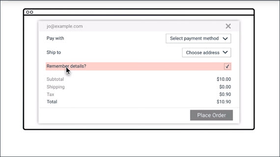](../assets/images/full-size/wa10-4.png)

So now let's wave our accessibility wand and see with those issues fixed.

[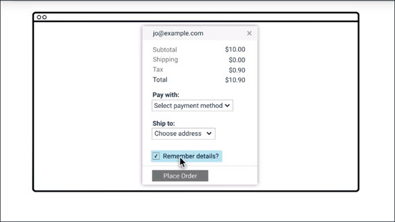](../assets/images/full-size/wa10-5.png)

Here are the changes.
1. We've made that low contrast text darker.
2. We've modified the design so the labels are right next to things they're labeling.
3. We fixed that label to be associated with the check box. So now I can check and uncheck it by clicking anywhere on the label.

I'm much more comfortable actually using the accessible version. Sure, I could probably get by with the old version but it would cause some extra stress and possibly cause me to make mistakes if I was in a hurry or distracted.

True story, I once accidentally had something shipped to me in San Francisco instead of my parents in Australia, because of a form that looked a lot like the previous one we just saw. So, while we want to address accessibility first and foremost to avoid excluding people from accessing things, it certainly isn't a zero sum game. We're more likely to make things better for everyone by addressing accessibility.

### 10.3 Diversity of Users
Hi, my name is Victor Tsaran and I work as a technology program manager at Google. At Google I work on making sure that the products we create are accessible to the audience of our diverse users, regardless of their ability or impairment.

Modern web technologies make it very easy for a developer to create a website that's difficult for someone who is blind to use.

If a user has no vision, it's quite likely they would be using a screen reader, which is software that allows them to hear the information displayed on the screen via a text to speech synthesizer.

They may also be using Braille which allows them to feel the on-screen text with their fingers when using braille display.

[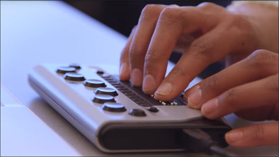](../assets/images/full-size/wa10-7.png)

Many websites are visual in their nature and lack keyboard navigation which is essential for blind people to be able to navigate through the content.

In general, it is safe to assume that there are more people with visual impairments, that is people who have some sight, as opposed to people who are completely blind. There are also people with low visual acuity and they may be using large print text or magnification when using the computer.

[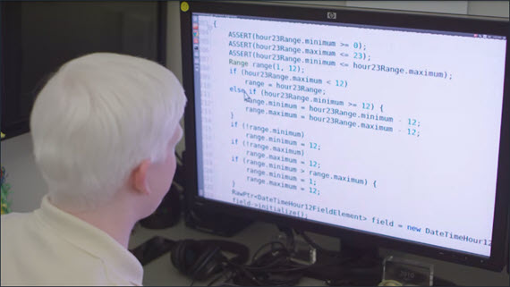](../assets/images/full-size/wa10-8.png)

For example, my friend Laura uses magnification with text to speech, as well as various color contrast options.

There are also people with poor color vision who may have difficulty distinguishing red and green or blue and yellow. This accounts for 9% of male and 1% of female.

We may also find ourselves with temporary challenges, such as when trying to use a computer in the sun or looking at a dodgy projector.

Whenever accessibility comes up in a conversation, people tend to picture someone who is blind like myself but there actually more impairments to think about and consider.

There is a huge number of people with motor or dexterity impairments. Such users may be using only the keyboard, head, or eye tracking software, switches, voice dictation etc. Someone may have a broken wrist, broken track pad, or simply riding the Shaker train.

By catering to users with permanent dexterity impairments, we ensure a great experience for everyone.

There are also users with hearing impairments. For example, some may be completely deaf, yet others have some hearing. The content that uses sound should provide some kind of visual alternative. For example, a messenger app could be using a flashing alert as well as sound notifications.

There are also users with cognitive impairments, for example ADD, dyslexia or autism. These users may require diverse accommodations, such as zooming the screen to make it easier to read the content, or minimal design to minimize destruction and cognitive load.

We can all probably relate to feeling stressful or cognitive load. So improving the experience for users with cognitive impairments makes it so much better experience for everybody else.

In summary, accessibility is really about making sure that the content and the websites we create is usable to people with various impairments or abilities.

#### Statistics
Some statistics on disability for the US:

- Around 2% of the population has some kind of vision disability (i.e. are blind or have significant difficulty seeing even with glasses)
- Around 50% of the population has some kind of clinically significant refractive error (a visual impairment which may be corrected with glasses if mild enough)
- Around 8% of males and 0.5% of females have some form of color vision deficiency
- Around 2% of adults have a hearing disability
- Over 4% have a cognitive disability (difficulty remembering, concentrating, or making decisions)

#### Sources
- [Disability Compendium](http://disabilitycompendium.org/)
- ["The Perception of Color"](http://www.ncbi.nlm.nih.gov/books/NBK11538/)
- ["Prevalence of Refractive Error in the United States, 1999-2004"](http://archopht.jamanetwork.com/article.aspx?articleid=420707)

### 10.4 Quiz: Broken Arm
#### Question 1 of 2
Which categories does the impairment **broken arm** fit into? (check all that apply)
- [ ] Visual
- [x] Motor
- [ ] Hearing
- [ ] Cognitive

#### Question 2 of 2
Which temporalities does the impairment **broken arm** fit into? (check all that apply)
- [x] Temporary
- [ ] Permanent
- [ ] Situational

### 10.5 Quiz: Blindness
#### Question 1 of 2
Which categories does the impairment **blindness** fit into? (check all that apply)
- [ ] Visual
- [x] Motor
- [ ] Hearing
- [ ] Cognitive

#### Question 2 of 2
Which temporalities does the impairment **blindness** fit into? (check all that apply)
- [x] Temporary
- [ ] Permanent
- [ ] Situational

### 10.6 Quiz: Audio
#### Question 1 of 2
Which categories does the impairment **don't, or can't, listen to audio in an open office floor plan** fit into? (check all that apply)
- [ ] Visual
- [ ] Motor
- [x] Hearing
- [ ] Cognitive

#### Question 2 of 2
Which temporalities does the impairment **don't, or can't, listen to audio in an open office floor plan** fit into? (check all that apply)
- [ ] Temporary
- [ ] Permanent
- [x] Situational

### 10.7 Quiz: Baby
#### Question 1 of 2
Which categories does the impairment **holding a baby in one arm** fit into? (check all that apply)
- [ ] Visual
- [x] Motor
- [ ] Hearing
- [ ] Cognitive

#### Question 2 of 2
Which temporalities does the impairment **holding a baby in one arm** fit into? (check all that apply)
- [ ] Temporary
- [ ] Permanent
- [x] Situational

### 10.7 Quiz: Concussion
#### Question 1 of 2
Which categories does the impairment **concussion** fit into? (check all that apply)
- [x] Visual
- [x] Motor
- [ ] Hearing
- [x] Cognitive

#### Question 2 of 2
Which temporalities does the impairment **concussion** fit into? (check all that apply)
- [x] Temporary
- [ ] Permanent
- [ ] Situational

### 10.8 Quiz: Repetitive Strain Injury
#### Question 1 of 2
Which categories does the impairment **Repetitive Strain Injury (RSI)** fit into? (check all that apply)
- [ ] Visual
- [x] Motor
- [ ] Hearing
- [ ] Cognitive

#### Question 2 of 2
Which temporalities does the impairment **Repetitive Strain Injury (RSI)** fit into? (check all that apply)
- [x] Temporary
- [x] Permanent
- [ ] Situational

### 10.10 Using a Screen Reader
Hi, this is Victor again and this time I'd like to show you how I use a screen reader on everyday basis. In this particular case I will be using one of my daily things and that is looking at a public forum that talks about accessibility issues for the Android operating system.

[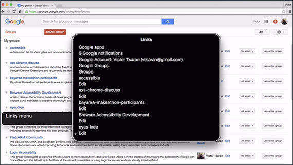](../assets/images/full-size/wa10-11.png)

You will notice that my screen reader speaks really fast. As a beginner user you tend to listen at much lower speeds but as you gain efficiency with the screen reader, you will find that making it speak faster improves efficiency when browsing content on websites.

So back to my public form.I'm going to go to groups website.

Since I use this website every day I know that it provides a lot of shortcut keys that allows me to browse this website much faster.

So first I'll go to my groups. And now I will be using a screen reader functionality there allows me to browse through the links on this webpage because I'd like to find a specific public forum I'm looking for.

Here you will see I have a few message threads and quite recently I heard about this new app called Swift. It's a braille Keyboard that allows people who are blind to type braille faster on Android.

So I'm going to go back to this thread and look at some of the messages that I may have missed. Looking at messages that I included in this thread. I used again, shortcut keys to quickly move through messages. If there is anything new since the last time I looked at this forum. Yeah, there's quite a bit to read.

Anyway I hope this gives you a quick glance into how I use this view to an everyday basis.

### 10.11 Quiz: Experiencing a Screen Reader
Alright, it's time to start working with a screen reader. Head over to [this sample page](http://udacity.github.io/ud891/lesson1-overview/06-experiencing-screen-reader/) and click the 'Enable ChromeVox Lite' button to get started. When you're finished, come back here and enter the secret word.

**Important:** To navigate with [ChromeVox](http://www.chromevox.com/) Lite you will need to use the buttons at the bottom of the screen. If you try to just click on the button with your mouse the page will lose focus and you'll have to refresh and start over. So... no cheating! "ChromeVox Lite" is a modified version of ChromeVox which is injected into some of the pages used in this course. Using ChromeVox Lite is optional for all exercises - the examples should will work just as well with the ChromeVox extension, or any other screen reader you may already be familiar with. If you do choose to use ChromeVox Lite, it's very simple:

- Enable ChromeVox Lite via the "Enable ChromeVox Lite" button in the bottom right hand corner of the screen, or via the other "Enable ChromeVox Lite" button which appears if you press `TAB` once.
- The controls for ChromeVox Lite will appear once it is enabled:
  - The "Voice" drop-down allows you to choose alternate voices
  - The "Speech rate" drop-down allows you to make the speech faster or slower (if you find yourself getting bored waiting for ChromeVox to finish what it's saying, try speeding it up!)
  - The "Navigate" buttons allow you to move ChromeVox's focus to non-focusable items on the page, such as headers
  - Finally, the volume control allows you to fine-tune ChromeVox's volume.

### 10.12 Checklists
Because accessibility is so broad and the usership is so diverse, we're going to need a roadmap to guide us on our journey. Throughout this course we'll be referring to **WCAG**, or the **Web Content Accessibility Guidelines 2.0**.

WCAG is a set of guidelines and best practices which have been put together by accessibility experts to try and answer the question of what accessibility means in a methodical way.

Several countries actually mandate the use of these guidelines in their web accessibility legal requirements.

WCAG is organized around four core principles.

- **Perceivable** - The first is making sure users can perceive content. This helps us keep in mind that just because something is perceivable with one sense such as sight, that doesn't mean that all users can perceive it.
- **Operable** - Second, is it operable? Can users use UI components and navigate the content? For example something which requires a hover interaction cannot be operated by someone who can't use a mouse or is using a touchscreen.
- **Understandable** - Third, can users understand the content? Also, can all users understand the interface and is it consistent enough to avoid confusion?
- **Robust** - Is it robust enough for the content to be consumed by a wide variety of user agents and does it work with assistive technology?

Together this forms **POUR**.

While WCAG provides an extremely comprehensive set of guidelines to help us keep many facets of accessibility in mind, it can also be a bit overwhelming. To help mitigate this, the WebAIM group has distilled the WCAG guidelines down into an easy to follow checklist, targeted specifically for web content.

The webbing checklist can give you a short high level summary of what you need to implement while also linking to the underlying or tag specifications if you need an expanded definition.

Both WCAG and the checklist cover a lot of the accessibility space.The guidelines can only ever be a limited proxy for actual accessibility. What actually matters is the user experience, not just checking some box.

So while these guidelines give us a framework for thinking about accessibility, there may be places where they're incomplete or even give advice which is a little out of date. However, they're still an excellent resource for helping us integrate accessibility into our process.

With these tools in hand we can chart a direction for our accessibility work and be confident that, so long as our project is meeting the outlined criteria, our users should have a positive experience.

#### Resources

- [Web Content Accessibility Guidelines 2.0 (WCAG)](https://www.w3.org/TR/WCAG20/)
- [WebAIM Checklist for WCAG 2.0](http://webaim.org/standards/wcag/checklist)- [Web Content Accessibility Guidelines 2.0 (WCAG)](https://www.w3.org/TR/WCAG20/)
- [WebAIM Checklist for WCAG 2.0](http://webaim.org/standards/wcag/checklist)

### 10.13 Quiz: Using WebAIM Checklist
Using the [WebAIM Checklist for WCAG 2.0](http://webaim.org/standards/wcag/checklist), find the matching rule that dictates "the web page has a descriptive and informative page title."

- **Rule:** 2.4.2
- **Section:** Operable

### 10.14 Course Practicalities
1. We've heard a lot about what accessibility is and why it matters for everyone
2. We heard about some different types of impairments and what we might need to think about
3. We saw what it's like to use a screen reader
4. We took a quick look at WCAG and the WebAIM accessibility checklist

For the rest of the course we're going to dive into the practicalities of actually creating accessible websites. We're not going to just talk at you for the whole course, you're going to actually create some accessible code

We're going to organize this around three main topics

- **Focus** and keyboard which looking at how to make sure that we build things which can be operated with a keyboard. This is important for users with motor impairments but also ensures that your UI is in a good shape for the next topic which is semantics.
- **Semantics** is where we make sure that we're expressing our interface in a robust way which works with a variety of assistive technology.And finally 
- **Styling** and visual design. We'll look at some techniques for making sure the visual UI is as flexible and usable as possible.

Now each of those topics could probably fill a whole course by themselves. So we're not going to be able to cover every single aspect of creating accessible websites. However, we're going to give you enough information to get started and point you at some good places to learn more about each topic.

I'm sure you're all eager to get started so let's begin with a look at how and why you need to think about focus in your web application.

## Lesson 11. Focus
### 11.1 Intro to Focus
In this lesson I'll be talking about focus and how you can manage it in your application.

Now in a nutshell, focus refers to the control on the computer screen that receives input from the keyboard and from the clipboard when you paste.

You're probably familiar with focus for text fields. In order to type in a text field you first have to go over with your mouse and click on it. Well that act of clicking on the text field, that's actually what focuses it. You may also know that if you then press the [tab] key it will then move focus to the next text field or available control.

Now some users drive the computer entirely with the keyboard or some other type of discrete input device. For those users, focus is absolutely critical. It's their primary means of reaching everything on the screen. And so for that reason the Web AIM checklist states in section 2.1.1, that all page functionality should be available using the keyboard, unless it's something you couldn't normally do with a keyboard like freehand drawing or something like that.

[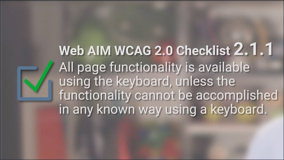](../assets/images/wa10-17.jpg)

So this is a great place to start learning about accessibility because obviously we all know how to use a keyboard. It's very easy to relate to and test, and it benefits virtually all of our users.

There's users out there with motor impairments which could be caused by anything from paralysis or even just a broken arm. Those folks may be relying on a keyboard or switch device to navigate your page, so a good focus strategy is going to be absolutely critical for them.

For the power users out there, those folks who know every keyboard shortcut on their machine and hate having to use the mouse, well, for them, being able to navigate, for instance, a form on your site, is just going to make them more productive.

So well-implemented focus strategy means everyone using your application will have a better experience. And as we'll see in the next few lessons, the work that we do today on focus is actually an important primer for supporting assistive technology users.

#### WebAIM checklist item

- 2.1.1: [http://webaim.org/standards/wcag/checklist#sc2.1.1](http://webaim.org/standards/wcag/checklist#sc2.1.1)

### 11.2 What is Focus
As you learned in the previous lesson, focus determines where keyboard events go in the page.

[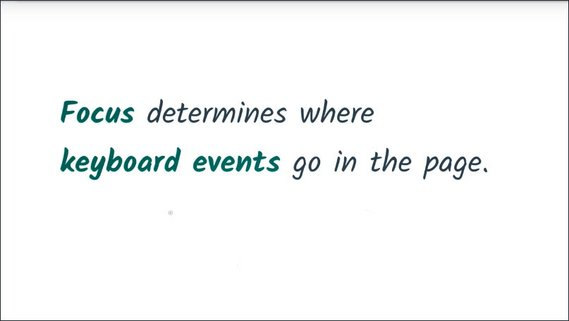](../assets/images/wa10-18.jpg)

To give you an example, if I go over and focus this text input field using my mouse and then begin typing, the input receives the keyboard events and displays the characters as I've typed them.

The currently focused item is often indicated by a focus ring, where the actual styling of that ring depends on the browser and any additional styling that the page author may have applied.

As a user,you can control which element is currently focused using your keyboard. Pressing the Tab key will move focus forward through the document.

Shift+Tab moves focus backwards.

[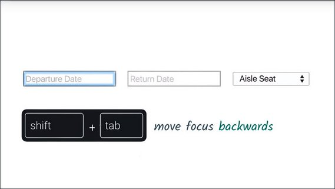](../assets/images/wa10-21.jpg)

And you can use the arrow keys to move focus around within a component.

On MacOS X, this works a little differently. While Chrome will always let you navigate with Tab, you'll need to press Option+Tab in order to change focus in other browsers like Safari.

If you like, you can change this by going to your System Preferences, going to the Keyboard section, clicking on the Shortcuts tab and then changing this radio group to say All controls.

To give you an example of focus in the real world, here I am on Wikipedia, and as I press the Tab key, the browser is going to navigate through all of the focusable elements on the page. 

Eventually I'll reach a stopping point and hit Shift+Tab and now I'm moving backwards through the page. This ordering is called, creatively enough, the tab order.

[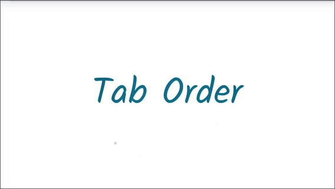](../assets/images/wa10-24.jpg)

Making sure your application has a logical tab order is an important step, which we're going to cover later on in this course.

Now built-in interactive HTML elements like input, button, and select are all implicitly focusable. Meaning that they're automatically inserted in the tab order and that they also have built-in keyboard event handling.

But not all elements are focusable.

This header, the paragraph below it, and this image are not focusable, and they're not implicitly inserted in the tab order. That's by design.There's generally no need to focus something ifa user can't interact with it or provide it some sort of input.

#### Notes
Move focus around the page using your keyboard:

- `TAB` will move focus forward
- `SHIFT - TAB` will move focus backwards
- `Arrow keys` can be used to navigate inside of a component

[https://www.w3.org/TR/html5/editing.html#focus-management](https://www.w3.org/TR/html5/editing.html#focus-management)

### 11.3 Quiz: Experience Focus
Let's try out some of the focus techniques discussed in the previous lesson. I'd like you to search for a ticket on Udacity's new Australian airline website using your keyboard.

[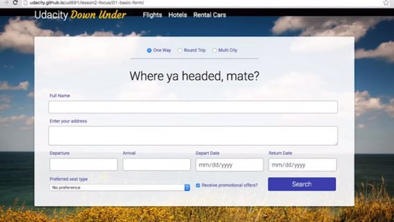](../assets/images/wa10-27.jpg)

We've disabled the mouse on this page, so you can't cheat. I'd like for you to search for a ticket that is a round trip to Melbourne leaving on 10/12/2017 returning on 10/23/2017, is a window seat, and you do not want to receive any promotional offers.

#### Quiz
Try out our [flight booking form](http://udacity.github.io/ud891/lesson2-focus/01-basic-form/) using only your keyboard. You'll need to search for a ticket that matches the following criteria:

The ticket should...

- Be a round trip
- to Melbourne
- leaving on 10/12/2017
- returning on 10/23/2017
- window seat
- and you DO NOT want to receive promotional offers 😀

If you've filled out the form correctly then pressing the Search button should give you a notification that you've passed.

#### Remember

- `TAB` will move focus forward to the next element
- `SHIFT - TAB` will move focus backwards to the previous element
- `Arrow Keys` can be used to move focus within an element

<!--
### 11.4 DOM Order Matters
So working with native elements is great for focus behavior, because they're automatically inserted into the tab order based on their position in the DOM.

To give you an example I've written a little bit of HTML here.

[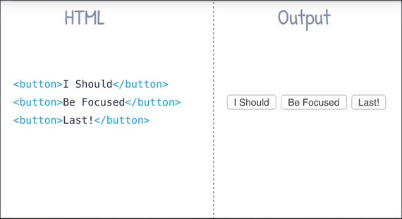](../assets/images/wa10-28.jpg)

I've got three button elements andthen you can see the output over here on the right.So there's three button elements rendering inside of my browser.Now because the tab order corresponds to the DOM order, when I go andpress the tab key you'll see that the first button elementgets the focus indicator around it.And as I keep pressing tab, you'll see the next item in the DOM order getsfocused and tab again, now the last item in the DOM order is focused.Now it's important note that using something like CSS,it's possible to have things appear in one order on screen, butactually exist in a different order over in the DOM.To give you an example of that, what I've done now is I've justadded this inline style to my first button element andI'm telling it that I want to float to the right.Now what this is going to do is it's going to visually change the ordering ofthese buttons here such that our first DOM element is now appearinglast on screen visually.So even though the visual order has changed, the DOM order remains the same.Let's see how that effects tabbing.When I press the tab key, the first DOM element is still focused, butnow visually it's the last element in this group which is kind of weird.If I press tab again, now we see that the second DOM element,which is the first visual element becomes focused.And pressing tab again, I've got this middle element now being focused,even though that's the last DOM item.So the moral of the story is, be careful when you're using something like CSS tovisually change the position of your elements on screen.This can cause the tab order to jump around seemingly at random andfor users relying on a keyboard this can be extremely confusing.For this reason the WebAIM checklist specifically states in section 1.3.2that the reading and navigation order as determined by code ordershould be logical and intuitive in your application.I have just sort of a general rule of thumb.I like to tab through my page every sooften just to make sure I haven't accidentally messed up the tab order.It's a good habit to adopt andit's one that doesn't really require a ton of effort on my part.

-->