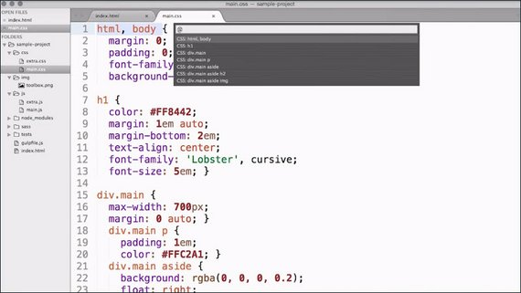
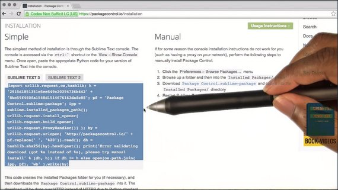
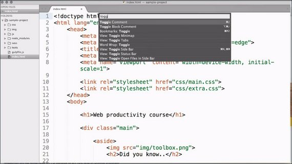

<!-- markdownlint-disable MD022 MD032 -->
<!-- # Mobile Web Specialist Nanodegree -->
# Web Tooling and Automation

[<-- back to Mobile Web Specialist Nanodegree homepage](../index.html)

---

### Supporting Links

## Lesson 9. Tools & Automation
### 9.1 Course Intro
This is Paul Bakaus, a Developer Advocate at Google, whose previous role as Studio CTO at Zinga was to keep his team tooled up to be as productive as possible.

With him is James Williams, a Course Developer at Udacity, where he makes Android and web courses.

[](../assets/images/tools1-1.jpg)

In the next few lessons, they're going to teach how to use tools to help you become a better and more efficient web developer whether you're just starting out, or have been around for a while.

Paul will translate all the tooling mumbo jumbo into English, and explain the ideas and concepts while James makes sure all the material stays in long term memory through course quizzes.

> **Quick disclaimer:** While I promise you'll come out of here supercharged and more productive than ever, it's going to involve
> - a lot of fiddling with the terminal
> - a lot of keyboard shortcuts
> - a general amount of "grunt work"

All right, let's talk about what you'll learn in this course.

1. We'll kick it off with setting up your developing environment, to achieve that perfect flow.
2. We'll get you a build process that you can delegate tasks to.
3. We'll dive into all the things your build process is good at.
- Expressive live coding
- preventing disasters
- saving a lot of time and effort with automatic optimizations.

Let's get going.

### 9.2 Quiz: Cost Effectiveness
While optimizing your work is generally good, you can definitely go overboard and over-optimize.

Before we teach you some good ways to optimize for the web, let's see if you can identify which optimizations are beneficial.

Which of the following optimizations are worth doing considering both the time and risk?

- [ ] A 10% speed up in launching your editor, that takes one hour.
- [ ] A post-process that tests your app on a mobile screen that takes a day to implement.
- [ ] An editor plugin that autocloses your HTML tags that takes 30 minutes to implement.
- [ ] A script that generates images for hi-res devices and takes four hours.

#### 9.2 Solution

- [ ] A 10% speed up in launching your editor, that takes one hour.

    No. Most editors launch in less than four or five seconds. So you'll be making the launch, at most, a half second faster. But chances are, you're only starting your editor once per day. So to get back that hour that you put in, you probably have to start and stop your editor for 20 years or so.
- [x] A post-process that tests your app on a mobile screen that takes a day to implement.

    Yes. Even though it takes a day to implement, testing your app manually on mobile devices is a much more time-intensive and cumbersome process that really doesn't scale well. So that day is well-invested.
- [x] An editor plugin that auto closes your HTML tags that takes 30 minutes to implement.

    Yes. As a front end developer, you'll be writing lots and lots of HTML and most HTML tags need to be closed. Even though it seems like a micro-optimization, this time that you save will accumulate really, really quickly.
- [x] A script that generates images for hi-res devices and takes four hours.

    Yes. Generating multi-resolution imagery is a perfect job for build tool.Even if it takes you have a day to set up a costumer script, it'll be worth it.

### 9.3 Common Sense
I know you're anxious to get to the juicy bits, but I need to give you some general advice, so you don't shoot yourself in the foot.

Not all tools are created equal, and like you learned in the quiz, not all optimizations are worth doing.

Let's go through a few common scenarios that set you up for failure. 

> #1 - "I can build a better tool from scratch!"

Chances are you probably can't. And even if you can, it won't be worth the time.

To give you a web dev example, hundreds of engineering years went into tiny js libraries like jQuery, including some of my time actually. And yet, countless developers have tried to replicate it with a 90% similar feature set, only to fail hard, again and again.

Even popular clones like Zepto, couldn't keep up when they realized that jQuery fixed a lot more cross-browser madness than people thought, even in modern browsers.

> #2 - "This new, 2 week old build tool built by this random dude is 20% faster than Gulp! Let's implement!"

Now we're talking idealistic versus pragmatic. Yes, that 20% speed increase will be ideal. But sticking to a tool that is well supported by the community is pragmatic.

Gulp might be a little slower than someone else's new tool but you'll find answers for your questions on stack overflow, plugins for virtually anything, and can rest assured, that the tool is going to be maintained by its creators. Don't just trust your instincts, but consider the long-term value for your project.

> #3 - "This tool is self-contained and does everything we want right now."

So, it's neatly contained. All in package, huh? Well, be careful with those. If a tool promises to do it all, and stays away from offering any sort of connection points such as an API or modules, the run.

Seriously, life is too short to buy into an ecosystem that you can't escape from, especially if the success of your site depends on it.

> #4 - "This optimization can shave a second off of dev time."

And finally, you should be careful with any micro optimizations that are just not worth it.

If you are doing an optimization of your work flow that takes, say four hours, and cuts a second away from a task you perform once during the day, you need to do it for 40 years to justify the investment.

## Lesson 10. Editor
### 10.1 Intro
In this lesson, you'll learn how to set up your development environment. Namely, your editor.

I thought you told me I could build a web pages with just Notepad and a browser.

Well, yeah, I mean in theory you can. In theory I could use chopsticks to eat a 16 ounce steak, but in practice there are tools that make the experience much less frustrating.

If done just the right way, you can achieve what most developers dream of: A state of mind called flow.

### 10.2 Code Editor vs IDE
Consider the possibilities of a multi-tool. If I have this baby with me, I could eat a steak on the go wherever I want to.

It might be a better experience if I use a simple knife though. Sure, it doesn't have all the bells and whistles, but it's really good at its main job, being a knife.

What we're comparing is here is an IDE versus a Code Editor.

[](../assets/images/tools1-2.jpg)

An IDE, short for Integrated Development Environment, is an attempt to create a development productivity Swiss army knife that can do it all: editing, debugging, building, compiling and even, optimizing.

The problem is that IDEs come at the expense of tools that do one thing really well.

That's not to say that IDEs never work. For app ecosystems, such as iOS or Android, the vendor offers official support, and controls both the programming language, and platform which is why so many native developers use Xcode, Android Studio, or Visual Studio.

But on the web, we already have to live with fragmentation. Different browsers, devices and standards. We could try to pretend that CSS, HTML and JavaScript come in a beautiful tightly controlled bundle and build an IDE around it, or we could do what most web developers decide to do: embrace the chaos and use individual tools best for each job while ensuring that they function well together.

### 10.3 Editor Choice
> **Note:** This course recommends using Sublime Text Editor 3.
>
> This used to be the industry standard but Stack Overflow's 2018 Developer Survey has Visual Studio Code ranked as the most popular developer environment tool with 34.9% respondents claiming to use it.
>
> VSCode is free and I recommed it as the better alternative. That said, here's the lesson text...

Choosing the right editor can be tricky due to the overwhelming options and religious developer battles. It's almost as bad as the ongoing battle of tabs versus spaces, or semicolon haters and lovers.

I'm making it super easy for you. In this course, we'll stick to Sublime text three. It's simple, extendable, fast, and very well supported by the community.

For free alternatives check out GitHub's Atom editor. It builds on a similar plugin architecture.

In the end, I won't be offended if you decide to use another editor. As long as you stay away from Notepad. Just make sure it's fast, can be extended with functionality, and is well supported and stable.

### 10.4 Learn you Editor
Chances are the relationship between you and your editor will be a long one, and like with any good relationship, you need to work on it and invest early on. If you don't, you'll frustrate each other and things get complicated.

In the first couple of days of using it, try on lots of built-in shortcuts and features, even if they seem overkill.

Try them all out and observe yourself. Which shortcuts stick? Which do you have to force yourself to use?

You'll get a pretty good feel for what matters.

### 10.5 Shortcuts
> **Note:** The shortcut keys discussed below are for Sublime Text Editor although some key comibinations are the same for VS Code.
>
> While shortcut combinations differ from editor to editor (and those of my editor or choice, VS Code), the keyboard actions discussed here are still useful to know and can be applied to any editor regardless of specific key combinations.
>
> They will save you time regardless of which editor you use.

From now on, I will use a few shortcuts here and there to jump around the editor and get different things done. I'm doing this on a Mac, thus I'm going to use the CMD key a lot, but most shortcuts work just as well on Windows by substituting CMD with CTRL.

Searching and finding matters a lot to me. Hitting CMD+T will bring up the fuzzy file finder. The search box forgives many spelling mistakes or omissions so jumping from file to file gets lightning fast.

[](../assets/images/tools1-3.jpg)

Most developers prefer this method over manually searching for a previously opened tab as this involves zero mouse input and no thinking about the tab position.

It's a perfect example of an action that looks more complex than clicking on a tab, but is actually faster and simpler.

Typing an @ symbol into that box, or directly typing CMD+R, will bring up the symbol search menu. This allows you to quickly locate stuff in the current file, and it works extremely well for CSS or JavaScript functions.

[](../assets/images/tools1-4.jpg)

Now I know I use this color somewhere else in this CSS file and I want to quickly locate it. So I have it already selected and on my keyboard I'm going to hit CMD+ALT+G and it finds the next instance of it. (VS Code: F3)

[](../assets/images/tools1-5.jpg)

Sublime Text has a very powerful tab completion feature. In a nutshell, tab completion allows you to type a whole lot less .And typing less usually results in your finishing faster.

So if I go into my HTML file and type in 'img' and hit Tab, it expands it out to the full image tag. It not only it created an image tag with the most important attributes for us, it also place the cursor in the right position for us to enter information in.

[](../assets/images/tools1-6.jpg)

Many editors support multiple selection these days. That's the ability to have multiple selections in the same document that aren't next to each other.

But most of the time, folks show that off with column selection, which can be done by holding the ALT key and dragging your cursor around. It sure looks cool but the use cases for it are so rare that I almost never use it.

So let's see how we can do this the Sublime way. So I have this word color right here selected and have pressed CMD+D. And it shows us the next instance of that word, without clearing the selection of the first.

[](../assets/images/tools1-7.jpg)

It doesn't stop there. CMD+CTRL+G selects all instances of the word throughout the whole file. You can think of it as a global selection.

So, this makes it very easy for us to quickly refactor.

### 10.6 Extending Editor
Remember how I told you that your editor is like that steak knife that was built to fulfill only a specific purpose? Well, that wasn't the entire truth.

It's true that most editors have figured out how to do a great job with basic editing, but almost all modern editors can be extended with functionality.

In Sublime's case, all of it comes from a healthy community of developers, like you. They were missing something and built it.

And indeed, right now your Sublime is a genetic text editor. It doesn't care about you being a web developer. In the next step you customize it so it becomes a front-end development editor.

Sublime doesn't have a built in plug in repository, so the first thing we'll need to do is install package control. Its the only time we'll manually need to install a plugin.

[](../assets/images/tools1-8.jpg)

We'll take this scary looking block of text [(https://packagecontrol.io/installation)](https://packagecontrol.io/installation) and paste it into Sublime's terminal. And with that it's fetching the plug in and installing all of the dependencies.

Let's test whether it worked. Type Command+Shift+P to bring up Sublime's command palette. This drop down menu is useful in many ways because it contains all the actions Sublime can do.

[](../assets/images/tools1-9.jpg)

I generally use it to discover stuff I didn't know about, like this toggle comment action andto execute actions that don't have shortcuts or have crazy long ones.

But right now, type in P-A-C, and you'll see many new commands associated with package control. The one we really care about is install package. (VSCode: ext)

This is the list of all of the packages in the repository. So now that we're prepared, let's install a few of our favorite plugins. (The links are below)

- Emmet
- Sidebar Enhancements
- Color Picker
- Color Highlighter

Through package control's install command, please install Emmet, Sidebar Enhancements, Color Picker and Color Highlighter. Some plugins require restarting the editor. So to make sure to do that after you have installed everything.

Emmet dramatically extends and improves Sublime's built in text snippets. Its craziest feature is the ability to use CSS selectors to create newHTML markup. I know that sounds a bit confusing, but let me tell you what I mean.

Let's say I need a list with four items in my index.html file. I can do that by typing

- `ul#nav>li*4`

Then pressing Tab expands the selector into the HTML we specify.

```html
<ul id="nav">
  <li></li>
  <li></li>
  <li></li>
  <li></li>
</ul>
```

Emmet comes with a lot more built in magic that you should definitely check out in the link in the instructor's notes.

The Sidebar Enhancements plugin has a pretty descriptive and spot on name. It mostly extends the right-click menu of Sublime's usually pretty bare-bones sidebar with all of the stuff you would expect. Deleting files, new folders and so on. But also, some nifty stuff such as copying content as a data URI.

Now, these last two, Color Picker and Color Highlighter work together to make editing and working with colors in CSS, much easier.

Pressing Cmd+Shift+C opens the system color picker and allows you to quickly choose a color. And when the cursor is placed in or around an existing color, picking a new one will update it.

[](../assets/images/tools1-10.jpg)

The highlighter outlines or underlines colors it finds in your CSS with a preview so you always have an idea what you're looking at.

#### Sublime Resources

- [Package Control](https://packagecontrol.io/): The Sublime Text package manager
- [Emmet](http://emmet.io/) home page
- [Emmet on Package Control]()https://packagecontrol.io/packages/Emmet
- [SideBarEnhancements](https://packagecontrol.io/packages/SideBarEnhancements) on Package Control
- [ColorPicker](https://packagecontrol.io/packages/ColorPicker) on Package Control
- [ColorHighlighter](https://packagecontrol.io/packages/Color%20Highlighter) on Package Control

### 10.7 Quiz: Using the Palette
Which of these shortcuts converts text to lowercase? For a quick hint, check the command palette.

Check the command palette if you get stuck.

- [ ] CTRL + L
- [ ] CMD + SHIFT + L
- [ ] CMD + K, CMD + L
- [ ] CMD + SPACE, L

#### 10.7 Solution
The correct choice was CMD + K, CMD + L.

Remember to use the command pallet to look up any commands that you want to learn the shortcuts for.

You do this by opening the command palette, and start typing any part of the command. In this case, "L + O + W..." for lowercase. It will bring up the Transform to Lowercase command.

### 10.8 Wrap up
And with that, we're already at the end of the lesson.

I encourage you to not just experiment with different commands and plugins but try to get even more familiar with the editor.

Take your time and try out lots of plugins from the package control website or see how Sublime feels with code you have already written.